# Basel III credit risk decision tree

A corrected and extended version of the credit-risk exposure decision tree. References in brackets are to the BCBS consolidated framework (CRE = credit risk, MAR = market risk, LEX = large exposures, RBC = risk-based capital).

```mermaid
graph TD
    Start["Bank credit exposure (Basel III, consolidated framework)"] --> Boundary{"Banking book or trading book?"}
    Boundary -->|"Trading book (held with trading intent)"| MarketRisk["Market risk framework (FRTB, MAR)<br/>Credit RWA out of scope, but CCR below still applies"]
    Boundary -->|"Banking book"| ExposureType{"How does the exposure arise?"}

    %% 1. On-balance sheet
    ExposureType -->|"1. On-balance sheet (funded)"| Direct["Loans, advances, debt securities, placements, deposits with banks"]
    Direct --> EAD_Direct["EAD = carrying amount net of specific provisions"]
    EAD_Direct --> Class

    %% 2. Off-balance sheet
    ExposureType -->|"2. Off-balance sheet (unfunded)"| OffBS{"Instrument type (CRE20 CCF table)"}
    OffBS -->|"Direct credit substitutes: financial guarantees, standby LCs, acceptances"| CCF100["CCF 100%"]
    OffBS -->|"Transaction-related contingents: performance and bid bonds, warranties; NIFs and RUFs"| CCF50["CCF 50%"]
    OffBS -->|"Committed facilities, not unconditionally cancellable"| CCF40["CCF 40%"]
    OffBS -->|"Short-term self-liquidating trade LCs"| CCF20["CCF 20%"]
    OffBS -->|"Unconditionally cancellable commitments"| CCF10["CCF 10%"]
    CCF100 --> EAD_Off["EAD = notional x CCF<br/>A-IRB may use own CCFs only for revolving commitments"]
    CCF50 --> EAD_Off
    CCF40 --> EAD_Off
    CCF20 --> EAD_Off
    CCF10 --> EAD_Off
    EAD_Off --> Class

    %% 3. Counterparty credit risk
    ExposureType -->|"3. Counterparty credit risk (pre-settlement, both books)"| CCR{"Contract type"}
    CCR -->|"OTC and exchange-traded derivatives, long settlement transactions"| SACCR["SA-CCR (CRE52): EAD = 1.4 x (RC + PFE) per netting set<br/>or IMM (CRE53) with supervisory approval"]
    CCR -->|"SFTs: repo, reverse repo, securities lending, margin lending"| SFT["Comprehensive approach with supervisory haircuts (CRE22),<br/>VaR model, or IMM"]
    CCR -->|"Centrally cleared via a QCCP"| CCP["CRE54: 2% RW on trade exposures, formula for default-fund contributions"]
    SACCR --> Netting["Netting set = legally enforceable bilateral netting agreement (ISDA / CSA)<br/>Collateral enters via replacement cost and NICA, not as a later CRM step"]
    SFT --> Netting
    Netting --> Class
    CCP --> RWA
    SACCR -.-> CVA["CVA risk capital (MAR50): BA-CVA or SA-CVA<br/>Separate Pillar 1 charge, not part of credit RWA"]
    SFT -.-> CVA

    %% 4. Settlement risk
    ExposureType -->|"4. Unsettled or failed trades (settlement risk, CRE70)"| Settle{"DvP or PvP transaction?"}
    Settle -->|"Yes (DvP, PvP such as CLS)"| DvP["No charge until the trade fails<br/>After 5 business days: positive current exposure charged at 8% rising to 100%"]
    Settle -->|"No (free delivery)"| NonDvP["After paying first leg: treat as a loan to the counterparty<br/>After 4 business days: deduct full value from capital"]
    DvP --> RWA
    NonDvP --> RWA

    %% 5. Other frameworks
    ExposureType -->|"5. Securitisation tranche"| Sec["Securitisation framework (CRE40): SEC-IRBA, then SEC-ERBA, then SEC-SA"]
    ExposureType -->|"6. Equity in investment funds"| Funds["Look-through, mandate-based, or 1250% fall-back (CRE60)"]
    Sec --> RWA
    Funds --> RWA

    %% Exposure class
    Class{"Assign exposure class (CRE20 SA, CRE30 IRB)"}
    Class --> Sov["Sovereigns, central banks, PSEs, MDBs"]
    Class --> Banks["Banks and securities firms"]
    Class --> Corp["Corporates: general, SME, specialised lending (project, object, commodities), IPRE"]
    Class --> Retail["Regulatory retail: QRRE (transactors, revolvers), other retail, SME retail"]
    Class --> RE["Real estate: residential, commercial, ADC, split by LTV and cash-flow dependence"]
    Class --> Other["Equity, subordinated debt, covered bonds, defaulted exposures (90 days past due)"]

    %% Approach
    Sov --> Approach
    Banks --> Approach
    Corp --> Approach
    Retail --> Approach
    RE --> Approach
    Other --> Approach
    Approach{"Which approach is permitted and approved for this class?"}

    Approach -->|"Standardised approach (SA)"| SA_Node["Risk weight from table, no PD or LGD<br/>External rating (ECRA) or SCRA grades A, B, C for unrated banks<br/>LTV buckets for real estate; 75% regulatory retail; 100% unrated corporate, 85% SME"]
    Approach -->|"Foundation IRB (F-IRB)"| FIRB["Bank estimates PD; supervisory LGD, EAD and M<br/>Not available for retail; equity is SA only"]
    Approach -->|"Advanced IRB (A-IRB)"| AIRB["Bank estimates PD, LGD, EAD, M<br/>Not permitted for banks, financial institutions, or corporates with group revenue above EUR 500m"]
    FIRB --> Floors["Input floors: PD 5bp corporate and most retail, 10bp QRRE revolvers<br/>LGD and EAD floors for A-IRB"]
    AIRB --> Floors

    %% Credit risk mitigation
    SA_Node --> CRM{"Eligible credit risk mitigation? (CRE22, minimum legal certainty)"}
    Floors --> CRM
    CRM -->|"Eligible financial collateral"| Coll["Simple approach: substitute collateral RW, 20% floor<br/>Comprehensive approach: haircut-adjusted net exposure"]
    CRM -->|"Guarantee or credit derivative"| Guar["Substitution: protected portion takes guarantor's RW or PD"]
    CRM -->|"On-balance sheet netting"| OBSNet["Net loans against deposits with the same counterparty"]
    CRM -->|"Physical collateral, receivables (IRB only)"| Phys["F-IRB: supervisory LGD reduction<br/>A-IRB: own LGD estimate"]
    CRM -->|"None eligible"| NoCRM["Unsecured exposure"]
    Coll --> Mismatch["Adjust for maturity mismatch and currency mismatch"]
    Guar --> Mismatch
    OBSNet --> Mismatch
    Phys --> Mismatch
    NoCRM --> RWA
    Mismatch --> RWA

    %% RWA and capital
    RWA["Credit RWA<br/>SA: EAD x RW<br/>IRB: EAD x K(PD, LGD, M) x 12.5 (old 1.06 scaling factor removed)<br/>IRB: expected loss vs provisions, shortfall deducted from CET1"]
    RWA --> Floor["Output floor: total RWA at least 72.5% of full-SA RWA<br/>BCBS phase-in 50% (2023) to 72.5% (2028); local timelines differ"]
    Floor --> Capital["Pillar 1 minimums: CET1 4.5%, Tier 1 6%, Total 8% of RWA<br/>Plus capital conservation 2.5%, countercyclical, G-SIB and D-SIB buffers"]
    Capital --> Leverage["Leverage ratio at least 3% of Tier 1 over total exposure, no risk weights"]
    Leverage --> LEX["Large exposures (LEX): any single counterparty at most 25% of Tier 1,<br/>15% between G-SIBs"]
    LEX --> P2["Pillar 2 (ICAAP, SREP): concentration, IRRBB, stress testing<br/>Pillar 3: public disclosure"]
    P2 --> Decision{"Bank credit decision (internal policy, not a Basel rule)"}
    Decision -->|"Within risk appetite, limits, and return on RWA hurdle"| Approve["Approve and set limit"]
    Decision -->|"Breaches limits, capital, or return hurdle"| Reject["Decline, add CRM, reprice, or restructure"]

    %% Styling
    style Start fill:#1f2937,color:#fff,stroke:#1f2937,stroke-width:2px
    style MarketRisk fill:#6b7280,color:#fff,stroke:#6b7280
    style CVA fill:#6b7280,color:#fff,stroke:#6b7280
    style RWA fill:#1e3a8a,color:#fff,stroke:#1e3a8a,stroke-width:2px
    style Decision fill:#111827,color:#fff,stroke:#111827,stroke-width:2px
    style Approve fill:#065f46,color:#fff,stroke:#065f46,stroke-width:2px
    style Reject fill:#991b1b,color:#fff,stroke:#991b1b,stroke-width:2px
```

## What was wrong or missing in the original

1. **DvP, PvP and CLS are not credit risk mitigation.** Basel treats settlement risk under its own standard (CRE70). DvP trades carry no charge until they fail, and non-DvP free deliveries become a loan after the first leg is paid. The original routed these into the CRM step with collateral and netting.
2. **Netting is part of the CCR exposure calculation, not a later step.** Under SA-CCR the netting set and collateral enter through replacement cost and net independent collateral amount. They are not applied after EAD is computed.
3. **Repos and SFTs do not go through SA-CCR.** SFTs are measured with the comprehensive approach (supervisory haircuts), a VaR model, or IMM.
4. **PD and LGD only exist under IRB.** The standardised approach uses risk-weight tables keyed to external ratings, the SCRA grades for unrated banks, LTV for real estate, or fixed weights. The original showed PD/LGD assessment before the SA/IRB choice.
5. **IRB is not a free choice.** The finalised Basel III removed A-IRB for banks, financial institutions, large corporates, and all IRB for equity. Retail is A-IRB only. Input floors on PD, LGD and EAD and the 72.5% output floor were also missing.
6. **Residential mortgages are not regulatory retail.** Real estate is its own exposure class with LTV-based risk weights, split into residential, commercial, and ADC. Sovereigns, PSEs and MDBs were also merged with banks.
7. **Missing exposure classes and frameworks.** Specialised lending, equity, subordinated debt, covered bonds, defaulted exposures, securitisation (CRE40), equity in funds (CRE60), and central counterparty exposures (CRE54) were absent.
8. **CVA is a separate charge.** CVA risk capital sits in the market risk standard (MAR50) and is not part of credit RWA.
9. **CCFs were a single box.** The finalised standard has fixed CCFs by instrument: 10%, 20%, 40%, 50%, 100%.
10. **Physical collateral is IRB only.** Under SA only eligible financial collateral, guarantees, credit derivatives, and on-balance sheet netting count. Maturity and currency mismatch adjustments were missing.
11. **The chain stopped at RWA.** Basel continues to capital ratios and buffers, the leverage ratio, large exposure limits, Pillar 2 and Pillar 3. The final approve or reject gate is bank policy, not a Basel rule, and is labelled as such.
12. **Trading book boundary.** Credit RWA applies to the banking book. The trading book is under the market risk framework, though CCR applies to derivatives and SFTs in both books.

## Caveats

- Numbers reflect the BCBS finalised Basel III standard (sometimes called Basel 3.1 or the Basel endgame). National implementations differ, especially the output floor timeline, the SCRA weights, and real-estate risk weights.
- The diagram simplifies the IRB capital function and omits defaulted-exposure treatment under IRB, the SME size adjustment, and the specialised-lending slotting approach.

## SVG version (paste-ready for Obsidian)

Rendered from `basel-credit-risk-decision-tree.dot` with Graphviz. The inline SVG below renders in Obsidian reading view and scales to the pane width. The same image is saved as `basel-credit-risk-decision-tree.svg` next to this file if you prefer `![[basel-credit-risk-decision-tree.svg]]`.

<svg width="100%"
 viewBox="0.00 0.00 3450.30 2065.80" xmlns="http://www.w3.org/2000/svg" xmlns:xlink="http://www.w3.org/1999/xlink">
<g id="graph0" class="graph" transform="scale(1 1) rotate(0) translate(14.4 2051.4)">
<title>Basel</title>
<polygon fill="white" stroke="transparent" points="-14.4,14.4 -14.4,-2051.4 3435.9,-2051.4 3435.9,14.4 -14.4,14.4"/>
<g id="clust1" class="cluster">
<title>cluster_on</title>
<path fill="white" stroke="#9ca3af" stroke-dasharray="5,2" d="M974,-1429.5C974,-1429.5 1210,-1429.5 1210,-1429.5 1216,-1429.5 1222,-1435.5 1222,-1441.5 1222,-1441.5 1222,-1739 1222,-1739 1222,-1745 1216,-1751 1210,-1751 1210,-1751 974,-1751 974,-1751 968,-1751 962,-1745 962,-1739 962,-1739 962,-1441.5 962,-1441.5 962,-1435.5 968,-1429.5 974,-1429.5"/>
<text text-anchor="middle" x="1092" y="-1736.6" font-family="Helvetica,sans-Serif" font-size="13.00" fill="#374151">1. On&#45;balance sheet (funded)</text>
</g>
<g id="clust2" class="cluster">
<title>cluster_off</title>
<path fill="white" stroke="#9ca3af" stroke-dasharray="5,2" d="M20,-1350C20,-1350 942,-1350 942,-1350 948,-1350 954,-1356 954,-1362 954,-1362 954,-1737 954,-1737 954,-1743 948,-1749 942,-1749 942,-1749 20,-1749 20,-1749 14,-1749 8,-1743 8,-1737 8,-1737 8,-1362 8,-1362 8,-1356 14,-1350 20,-1350"/>
<text text-anchor="middle" x="481" y="-1734.6" font-family="Helvetica,sans-Serif" font-size="13.00" fill="#374151">2. Off&#45;balance sheet (unfunded): CCF by instrument (CRE20)</text>
</g>
<g id="clust6" class="cluster">
<title>cluster_ccr</title>
<path fill="white" stroke="#9ca3af" stroke-dasharray="5,2" d="M1242,-1337C1242,-1337 2107,-1337 2107,-1337 2113,-1337 2119,-1343 2119,-1349 2119,-1349 2119,-1737 2119,-1737 2119,-1743 2113,-1749 2107,-1749 2107,-1749 1242,-1749 1242,-1749 1236,-1749 1230,-1743 1230,-1737 1230,-1737 1230,-1349 1230,-1349 1230,-1343 1236,-1337 1242,-1337"/>
<text text-anchor="middle" x="1674.5" y="-1734.6" font-family="Helvetica,sans-Serif" font-size="13.00" fill="#374151">3. Counterparty credit risk (pre&#45;settlement, both books)</text>
</g>
<g id="clust11" class="cluster">
<title>cluster_settle</title>
<path fill="white" stroke="#9ca3af" stroke-dasharray="5,2" d="M1755,-435C1755,-435 2297,-435 2297,-435 2303,-435 2309,-441 2309,-447 2309,-447 2309,-646 2309,-646 2309,-652 2303,-658 2297,-658 2297,-658 1755,-658 1755,-658 1749,-658 1743,-652 1743,-646 1743,-646 1743,-447 1743,-447 1743,-441 1749,-435 1755,-435"/>
<text text-anchor="middle" x="2026" y="-643.6" font-family="Helvetica,sans-Serif" font-size="13.00" fill="#374151">4. Unsettled or failed trades (CRE70)</text>
</g>
<g id="clust12" class="cluster">
<title>cluster_other</title>
<path fill="white" stroke="#9ca3af" stroke-dasharray="5,2" d="M2361,-1423C2361,-1423 2591,-1423 2591,-1423 2597,-1423 2603,-1429 2603,-1435 2603,-1435 2603,-1661 2603,-1661 2603,-1667 2597,-1673 2591,-1673 2591,-1673 2361,-1673 2361,-1673 2355,-1673 2349,-1667 2349,-1661 2349,-1661 2349,-1435 2349,-1435 2349,-1429 2355,-1423 2361,-1423"/>
<text text-anchor="middle" x="2476" y="-1658.6" font-family="Helvetica,sans-Serif" font-size="13.00" fill="#374151">5 and 6. Separate frameworks</text>
</g>
<g id="clust14" class="cluster">
<title>cluster_class</title>
<path fill="white" stroke="#9ca3af" stroke-dasharray="5,2" d="M328,-1116C328,-1116 1632,-1116 1632,-1116 1638,-1116 1644,-1122 1644,-1128 1644,-1128 1644,-1195 1644,-1195 1644,-1201 1638,-1207 1632,-1207 1632,-1207 328,-1207 328,-1207 322,-1207 316,-1201 316,-1195 316,-1195 316,-1128 316,-1128 316,-1122 322,-1116 328,-1116"/>
<text text-anchor="middle" x="980" y="-1192.6" font-family="Helvetica,sans-Serif" font-size="13.00" fill="#374151">Exposure classes</text>
</g>
<g id="clust18" class="cluster">
<title>cluster_approach</title>
<path fill="white" stroke="#9ca3af" stroke-dasharray="5,2" d="M516,-788C516,-788 1674,-788 1674,-788 1680,-788 1686,-794 1686,-800 1686,-800 1686,-974 1686,-974 1686,-980 1680,-986 1674,-986 1674,-986 516,-986 516,-986 510,-986 504,-980 504,-974 504,-974 504,-800 504,-800 504,-794 510,-788 516,-788"/>
<text text-anchor="middle" x="1095" y="-971.6" font-family="Helvetica,sans-Serif" font-size="13.00" fill="#374151">Approach</text>
</g>
<g id="clust23" class="cluster">
<title>cluster_crm</title>
<path fill="white" stroke="#9ca3af" stroke-dasharray="5,2" d="M408,-448C408,-448 1678,-448 1678,-448 1684,-448 1690,-454 1690,-460 1690,-460 1690,-645 1690,-645 1690,-651 1684,-657 1678,-657 1678,-657 408,-657 408,-657 402,-657 396,-651 396,-645 396,-645 396,-460 396,-460 396,-454 402,-448 408,-448"/>
<text text-anchor="middle" x="1043" y="-642.6" font-family="Helvetica,sans-Serif" font-size="13.00" fill="#374151">Credit risk mitigation</text>
</g>
<g id="clust28" class="cluster">
<title>cluster_cap</title>
<path fill="white" stroke="#9ca3af" stroke-dasharray="5,2" d="M1743,-199C1743,-199 3287,-199 3287,-199 3293,-199 3299,-205 3299,-211 3299,-211 3299,-291 3299,-291 3299,-297 3293,-303 3287,-303 3287,-303 1743,-303 1743,-303 1737,-303 1731,-297 1731,-291 1731,-291 1731,-211 1731,-211 1731,-205 1737,-199 1743,-199"/>
<text text-anchor="middle" x="2515" y="-288.6" font-family="Helvetica,sans-Serif" font-size="13.00" fill="#374151">From RWA to the capital stack</text>
</g>
<g id="node1" class="node">
<title>Start</title>
<path fill="#1f2937" stroke="#1f2937" d="M1931,-2037C1931,-2037 1691,-2037 1691,-2037 1685,-2037 1679,-2031 1679,-2025 1679,-2025 1679,-2005 1679,-2005 1679,-1999 1685,-1993 1691,-1993 1691,-1993 1931,-1993 1931,-1993 1937,-1993 1943,-1999 1943,-2005 1943,-2005 1943,-2025 1943,-2025 1943,-2031 1937,-2037 1931,-2037"/>
<text text-anchor="middle" x="1811" y="-2018.8" font-family="Helvetica,sans-Serif" font-size="14.00" fill="white">Bank credit exposure</text>
<text text-anchor="middle" x="1811" y="-2003.8" font-family="Helvetica,sans-Serif" font-size="14.00" fill="white">(Basel III consolidated framework)</text>
</g>
<g id="node2" class="node">
<title>Boundary</title>
<polygon fill="#fef3c7" stroke="#d97706" points="1811,-1952 1704,-1918 1811,-1884 1918,-1918 1811,-1952"/>
<text text-anchor="middle" x="1811" y="-1921.4" font-family="Helvetica,sans-Serif" font-size="12.00">Banking book</text>
<text text-anchor="middle" x="1811" y="-1908.4" font-family="Helvetica,sans-Serif" font-size="12.00">or trading book?</text>
</g>
<g id="edge1" class="edge">
<title>Start&#45;&gt;Boundary</title>
<path fill="none" stroke="#4b5563" d="M1811,-1992.92C1811,-1983.05 1811,-1970.95 1811,-1959.42"/>
<polygon fill="#4b5563" stroke="#4b5563" points="1813.45,-1959.34 1811,-1952.34 1808.55,-1959.34 1813.45,-1959.34"/>
</g>
<g id="node3" class="node">
<title>Market</title>
<path fill="#6b7280" stroke="#6b7280" d="M1870,-1833C1870,-1833 1654,-1833 1654,-1833 1648,-1833 1642,-1827 1642,-1821 1642,-1821 1642,-1792 1642,-1792 1642,-1786 1648,-1780 1654,-1780 1654,-1780 1870,-1780 1870,-1780 1876,-1780 1882,-1786 1882,-1792 1882,-1792 1882,-1821 1882,-1821 1882,-1827 1876,-1833 1870,-1833"/>
<text text-anchor="middle" x="1762" y="-1816.4" font-family="Helvetica,sans-Serif" font-size="12.00" fill="white">Market risk framework (FRTB, MAR)</text>
<text text-anchor="middle" x="1762" y="-1803.4" font-family="Helvetica,sans-Serif" font-size="12.00" fill="white">Credit RWA out of scope,</text>
<text text-anchor="middle" x="1762" y="-1790.4" font-family="Helvetica,sans-Serif" font-size="12.00" fill="white">but CCR below still applies</text>
</g>
<g id="edge2" class="edge">
<title>Boundary&#45;&gt;Market</title>
<path fill="none" stroke="#4b5563" d="M1798,-1887.94C1791.41,-1873.22 1783.38,-1855.29 1776.59,-1840.09"/>
<polygon fill="#4b5563" stroke="#4b5563" points="1778.65,-1838.72 1773.56,-1833.33 1774.18,-1840.72 1778.65,-1838.72"/>
<text text-anchor="middle" x="1820" y="-1856" font-family="Helvetica,sans-Serif" font-size="10.00" fill="#374151"> &#160;trading book</text>
</g>
<g id="node4" class="node">
<title>ExpType</title>
<polygon fill="#fef3c7" stroke="#d97706" points="2071,-1824.5 1907.16,-1806.5 2071,-1788.5 2234.84,-1806.5 2071,-1824.5"/>
<text text-anchor="middle" x="2071" y="-1803.4" font-family="Helvetica,sans-Serif" font-size="12.00">How does the exposure arise?</text>
</g>
<g id="edge3" class="edge">
<title>Boundary&#45;&gt;ExpType</title>
<path fill="none" stroke="#4b5563" d="M1855.7,-1898.18C1905.38,-1877.25 1984.81,-1843.8 2032.05,-1823.9"/>
<polygon fill="#4b5563" stroke="#4b5563" points="2033.28,-1826.05 2038.78,-1821.07 2031.37,-1821.53 2033.28,-1826.05"/>
<text text-anchor="middle" x="1992.5" y="-1856" font-family="Helvetica,sans-Serif" font-size="10.00" fill="#374151"> &#160;banking book</text>
</g>
<g id="node5" class="node">
<title>Direct</title>
<path fill="#eef2ff" stroke="#6366f1" d="M1201.5,-1721C1201.5,-1721 982.5,-1721 982.5,-1721 976.5,-1721 970.5,-1715 970.5,-1709 970.5,-1709 970.5,-1693 970.5,-1693 970.5,-1687 976.5,-1681 982.5,-1681 982.5,-1681 1201.5,-1681 1201.5,-1681 1207.5,-1681 1213.5,-1687 1213.5,-1693 1213.5,-1693 1213.5,-1709 1213.5,-1709 1213.5,-1715 1207.5,-1721 1201.5,-1721"/>
<text text-anchor="middle" x="1092" y="-1704.4" font-family="Helvetica,sans-Serif" font-size="12.00">Loans, advances, debt securities,</text>
<text text-anchor="middle" x="1092" y="-1691.4" font-family="Helvetica,sans-Serif" font-size="12.00">placements and deposits with banks</text>
</g>
<g id="edge30" class="edge">
<title>ExpType&#45;&gt;Direct</title>
<path fill="none" stroke="#4b5563" d="M2010.09,-1795.13C1976.29,-1789.77 1933.42,-1783.6 1895,-1780 1597.8,-1752.12 1516.59,-1810.1 1224,-1751 1195.31,-1745.2 1164.58,-1734.11 1139.99,-1723.94"/>
<polygon fill="#4b5563" stroke="#4b5563" points="1140.63,-1721.55 1133.23,-1721.1 1138.74,-1726.07 1140.63,-1721.55"/>
</g>
<g id="node7" class="node">
<title>OffBS</title>
<polygon fill="#fef3c7" stroke="#d97706" points="533,-1719 436.23,-1701 533,-1683 629.77,-1701 533,-1719"/>
<text text-anchor="middle" x="533" y="-1697.9" font-family="Helvetica,sans-Serif" font-size="12.00">Instrument type?</text>
</g>
<g id="edge31" class="edge">
<title>ExpType&#45;&gt;OffBS</title>
<path fill="none" stroke="#4b5563" d="M2010.92,-1795.08C1976.99,-1789.63 1933.75,-1783.39 1895,-1780 1479.06,-1743.56 1372.42,-1781.49 956,-1751 825.56,-1741.45 673.4,-1721.7 591.83,-1710.41"/>
<polygon fill="#4b5563" stroke="#4b5563" points="591.91,-1707.94 584.63,-1709.41 591.23,-1712.8 591.91,-1707.94"/>
</g>
<g id="node14" class="node">
<title>CCR</title>
<polygon fill="#fef3c7" stroke="#d97706" points="1840,-1719 1756.35,-1701 1840,-1683 1923.65,-1701 1840,-1719"/>
<text text-anchor="middle" x="1840" y="-1697.9" font-family="Helvetica,sans-Serif" font-size="12.00">Contract type?</text>
</g>
<g id="edge32" class="edge">
<title>ExpType&#45;&gt;CCR</title>
<path fill="none" stroke="#4b5563" d="M2040.32,-1791.76C1996.67,-1772.19 1916.97,-1736.49 1872.39,-1716.51"/>
<polygon fill="#4b5563" stroke="#4b5563" points="1873.2,-1714.19 1865.81,-1713.56 1871.2,-1718.66 1873.2,-1714.19"/>
</g>
<g id="node20" class="node">
<title>Settle</title>
<polygon fill="#fef3c7" stroke="#d97706" points="2149,-628 2075,-594 2149,-560 2223,-594 2149,-628"/>
<text text-anchor="middle" x="2149" y="-597.4" font-family="Helvetica,sans-Serif" font-size="12.00">DvP or PvP</text>
<text text-anchor="middle" x="2149" y="-584.4" font-family="Helvetica,sans-Serif" font-size="12.00">(e.g. CLS)?</text>
</g>
<g id="edge33" class="edge">
<title>ExpType&#45;&gt;Settle</title>
<path fill="none" stroke="#4b5563" d="M2092.31,-1790.62C2115.41,-1772.56 2149,-1739.8 2149,-1702 2149,-1702 2149,-1702 2149,-720 2149,-691.66 2149,-659.7 2149,-635.19"/>
<polygon fill="#4b5563" stroke="#4b5563" points="2151.45,-635.16 2149,-628.16 2146.55,-635.16 2151.45,-635.16"/>
</g>
<g id="node23" class="node">
<title>Sec</title>
<path fill="#eef2ff" stroke="#6366f1" d="M2555,-1643C2555,-1643 2369,-1643 2369,-1643 2363,-1643 2357,-1637 2357,-1631 2357,-1631 2357,-1602 2357,-1602 2357,-1596 2363,-1590 2369,-1590 2369,-1590 2555,-1590 2555,-1590 2561,-1590 2567,-1596 2567,-1602 2567,-1602 2567,-1631 2567,-1631 2567,-1637 2561,-1643 2555,-1643"/>
<text text-anchor="middle" x="2462" y="-1626.4" font-family="Helvetica,sans-Serif" font-size="12.00">Securitisation tranche (CRE40)</text>
<text text-anchor="middle" x="2462" y="-1613.4" font-family="Helvetica,sans-Serif" font-size="12.00">Hierarchy: SEC&#45;IRBA,</text>
<text text-anchor="middle" x="2462" y="-1600.4" font-family="Helvetica,sans-Serif" font-size="12.00">then SEC&#45;ERBA, then SEC&#45;SA</text>
</g>
<g id="edge34" class="edge">
<title>ExpType&#45;&gt;Sec</title>
<path fill="none" stroke="#4b5563" d="M2100.76,-1791.66C2119.98,-1782.69 2145.5,-1770.73 2168,-1760 2249.88,-1720.96 2344.19,-1675.08 2403.45,-1646.15"/>
<polygon fill="#4b5563" stroke="#4b5563" points="2404.57,-1648.33 2409.79,-1643.06 2402.42,-1643.93 2404.57,-1648.33"/>
</g>
<g id="node24" class="node">
<title>Funds</title>
<path fill="#eef2ff" stroke="#6366f1" d="M2582.5,-1484C2582.5,-1484 2369.5,-1484 2369.5,-1484 2363.5,-1484 2357.5,-1478 2357.5,-1472 2357.5,-1472 2357.5,-1443 2357.5,-1443 2357.5,-1437 2363.5,-1431 2369.5,-1431 2369.5,-1431 2582.5,-1431 2582.5,-1431 2588.5,-1431 2594.5,-1437 2594.5,-1443 2594.5,-1443 2594.5,-1472 2594.5,-1472 2594.5,-1478 2588.5,-1484 2582.5,-1484"/>
<text text-anchor="middle" x="2476" y="-1467.4" font-family="Helvetica,sans-Serif" font-size="12.00">Equity in investment funds (CRE60)</text>
<text text-anchor="middle" x="2476" y="-1454.4" font-family="Helvetica,sans-Serif" font-size="12.00">Look&#45;through, mandate&#45;based,</text>
<text text-anchor="middle" x="2476" y="-1441.4" font-family="Helvetica,sans-Serif" font-size="12.00">or 1250% fall&#45;back</text>
</g>
<g id="edge35" class="edge">
<title>ExpType&#45;&gt;Funds</title>
<path fill="none" stroke="#4b5563" d="M2145.76,-1796.65C2271.53,-1780.06 2516.8,-1739.8 2568,-1673 2613.7,-1613.39 2607.63,-1567.81 2568,-1504 2564.41,-1498.22 2559.84,-1493.15 2554.67,-1488.71"/>
<polygon fill="#4b5563" stroke="#4b5563" points="2555.86,-1486.53 2548.84,-1484.14 2552.84,-1490.38 2555.86,-1486.53"/>
</g>
<g id="node6" class="node">
<title>EADdir</title>
<path fill="#eef2ff" stroke="#6366f1" d="M1167,-1477.5C1167,-1477.5 1017,-1477.5 1017,-1477.5 1011,-1477.5 1005,-1471.5 1005,-1465.5 1005,-1465.5 1005,-1449.5 1005,-1449.5 1005,-1443.5 1011,-1437.5 1017,-1437.5 1017,-1437.5 1167,-1437.5 1167,-1437.5 1173,-1437.5 1179,-1443.5 1179,-1449.5 1179,-1449.5 1179,-1465.5 1179,-1465.5 1179,-1471.5 1173,-1477.5 1167,-1477.5"/>
<text text-anchor="middle" x="1092" y="-1460.9" font-family="Helvetica,sans-Serif" font-size="12.00">EAD = carrying amount</text>
<text text-anchor="middle" x="1092" y="-1447.9" font-family="Helvetica,sans-Serif" font-size="12.00">net of specific provisions</text>
</g>
<g id="edge4" class="edge">
<title>Direct&#45;&gt;EADdir</title>
<path fill="none" stroke="#4b5563" d="M1092,-1680.65C1092,-1637.53 1092,-1533.54 1092,-1484.68"/>
<polygon fill="#4b5563" stroke="#4b5563" points="1094.45,-1484.61 1092,-1477.61 1089.55,-1484.61 1094.45,-1484.61"/>
</g>
<g id="node25" class="node">
<title>Class</title>
<polygon fill="#fef3c7" stroke="#d97706" points="1092,-1304 945,-1270 1092,-1236 1239,-1270 1092,-1304"/>
<text text-anchor="middle" x="1092" y="-1273.4" font-family="Helvetica,sans-Serif" font-size="12.00">Assign exposure class</text>
<text text-anchor="middle" x="1092" y="-1260.4" font-family="Helvetica,sans-Serif" font-size="12.00">(CRE20 SA, CRE30 IRB)</text>
</g>
<g id="edge36" class="edge">
<title>EADdir&#45;&gt;Class</title>
<path fill="none" stroke="#4b5563" d="M1092,-1437.35C1092,-1407.72 1092,-1350.12 1092,-1311.11"/>
<polygon fill="#4b5563" stroke="#4b5563" points="1094.45,-1311.05 1092,-1304.05 1089.55,-1311.05 1094.45,-1311.05"/>
</g>
<g id="node8" class="node">
<title>CCF100</title>
<path fill="#eef2ff" stroke="#6366f1" d="M492,-1570C492,-1570 334,-1570 334,-1570 328,-1570 322,-1564 322,-1558 322,-1558 322,-1516 322,-1516 322,-1510 328,-1504 334,-1504 334,-1504 492,-1504 492,-1504 498,-1504 504,-1510 504,-1516 504,-1516 504,-1558 504,-1558 504,-1564 498,-1570 492,-1570"/>
<text text-anchor="middle" x="413" y="-1553.4" font-family="Helvetica,sans-Serif" font-size="12.00">100%</text>
<text text-anchor="middle" x="413" y="-1540.4" font-family="Helvetica,sans-Serif" font-size="12.00">Direct credit substitutes:</text>
<text text-anchor="middle" x="413" y="-1527.4" font-family="Helvetica,sans-Serif" font-size="12.00">financial guarantees,</text>
<text text-anchor="middle" x="413" y="-1514.4" font-family="Helvetica,sans-Serif" font-size="12.00">standby LCs, acceptances</text>
</g>
<g id="edge9" class="edge">
<title>OffBS&#45;&gt;CCF100</title>
<path fill="none" stroke="#4b5563" d="M521.93,-1685.05C503.72,-1660.47 466.9,-1610.77 441.14,-1575.98"/>
<polygon fill="#4b5563" stroke="#4b5563" points="442.92,-1574.27 436.78,-1570.1 438.98,-1577.19 442.92,-1574.27"/>
</g>
<g id="node9" class="node">
<title>CCF50</title>
<path fill="#eef2ff" stroke="#6366f1" d="M738,-1570C738,-1570 566,-1570 566,-1570 560,-1570 554,-1564 554,-1558 554,-1558 554,-1516 554,-1516 554,-1510 560,-1504 566,-1504 566,-1504 738,-1504 738,-1504 744,-1504 750,-1510 750,-1516 750,-1516 750,-1558 750,-1558 750,-1564 744,-1570 738,-1570"/>
<text text-anchor="middle" x="652" y="-1553.4" font-family="Helvetica,sans-Serif" font-size="12.00">50%</text>
<text text-anchor="middle" x="652" y="-1540.4" font-family="Helvetica,sans-Serif" font-size="12.00">Transaction&#45;related:</text>
<text text-anchor="middle" x="652" y="-1527.4" font-family="Helvetica,sans-Serif" font-size="12.00">performance and bid bonds,</text>
<text text-anchor="middle" x="652" y="-1514.4" font-family="Helvetica,sans-Serif" font-size="12.00">warranties, NIFs and RUFs</text>
</g>
<g id="edge10" class="edge">
<title>OffBS&#45;&gt;CCF50</title>
<path fill="none" stroke="#4b5563" d="M544.2,-1684.76C562.3,-1660.11 598.54,-1610.78 623.99,-1576.14"/>
<polygon fill="#4b5563" stroke="#4b5563" points="626.12,-1577.37 628.29,-1570.28 622.17,-1574.47 626.12,-1577.37"/>
</g>
<g id="node10" class="node">
<title>CCF40</title>
<path fill="#eef2ff" stroke="#6366f1" d="M934,-1570C934,-1570 812,-1570 812,-1570 806,-1570 800,-1564 800,-1558 800,-1558 800,-1516 800,-1516 800,-1510 806,-1504 812,-1504 812,-1504 934,-1504 934,-1504 940,-1504 946,-1510 946,-1516 946,-1516 946,-1558 946,-1558 946,-1564 940,-1570 934,-1570"/>
<text text-anchor="middle" x="873" y="-1553.4" font-family="Helvetica,sans-Serif" font-size="12.00">40%</text>
<text text-anchor="middle" x="873" y="-1540.4" font-family="Helvetica,sans-Serif" font-size="12.00">Committed facilities</text>
<text text-anchor="middle" x="873" y="-1527.4" font-family="Helvetica,sans-Serif" font-size="12.00">(not unconditionally</text>
<text text-anchor="middle" x="873" y="-1514.4" font-family="Helvetica,sans-Serif" font-size="12.00">cancellable)</text>
</g>
<g id="edge11" class="edge">
<title>OffBS&#45;&gt;CCF40</title>
<path fill="none" stroke="#4b5563" d="M559.3,-1687.83C569.25,-1683.21 580.65,-1677.88 591,-1673 662.13,-1639.42 743.09,-1600.6 799.97,-1573.23"/>
<polygon fill="#4b5563" stroke="#4b5563" points="801.19,-1575.36 806.43,-1570.12 799.06,-1570.94 801.19,-1575.36"/>
</g>
<g id="node11" class="node">
<title>CCF20</title>
<path fill="#eef2ff" stroke="#6366f1" d="M117.5,-1570C117.5,-1570 28.5,-1570 28.5,-1570 22.5,-1570 16.5,-1564 16.5,-1558 16.5,-1558 16.5,-1516 16.5,-1516 16.5,-1510 22.5,-1504 28.5,-1504 28.5,-1504 117.5,-1504 117.5,-1504 123.5,-1504 129.5,-1510 129.5,-1516 129.5,-1516 129.5,-1558 129.5,-1558 129.5,-1564 123.5,-1570 117.5,-1570"/>
<text text-anchor="middle" x="73" y="-1553.4" font-family="Helvetica,sans-Serif" font-size="12.00">20%</text>
<text text-anchor="middle" x="73" y="-1540.4" font-family="Helvetica,sans-Serif" font-size="12.00">Short&#45;term</text>
<text text-anchor="middle" x="73" y="-1527.4" font-family="Helvetica,sans-Serif" font-size="12.00">self&#45;liquidating</text>
<text text-anchor="middle" x="73" y="-1514.4" font-family="Helvetica,sans-Serif" font-size="12.00">trade LCs</text>
</g>
<g id="edge12" class="edge">
<title>OffBS&#45;&gt;CCF20</title>
<path fill="none" stroke="#4b5563" d="M450.14,-1698.4C405.82,-1695.53 350.88,-1688.7 304,-1673 236.13,-1650.27 166.28,-1606 121.42,-1574.35"/>
<polygon fill="#4b5563" stroke="#4b5563" points="122.65,-1572.22 115.53,-1570.16 119.81,-1576.22 122.65,-1572.22"/>
</g>
<g id="node12" class="node">
<title>CCF10</title>
<path fill="#eef2ff" stroke="#6366f1" d="M285,-1570C285,-1570 191,-1570 191,-1570 185,-1570 179,-1564 179,-1558 179,-1558 179,-1516 179,-1516 179,-1510 185,-1504 191,-1504 191,-1504 285,-1504 285,-1504 291,-1504 297,-1510 297,-1516 297,-1516 297,-1558 297,-1558 297,-1564 291,-1570 285,-1570"/>
<text text-anchor="middle" x="238" y="-1553.4" font-family="Helvetica,sans-Serif" font-size="12.00">10%</text>
<text text-anchor="middle" x="238" y="-1540.4" font-family="Helvetica,sans-Serif" font-size="12.00">Unconditionally</text>
<text text-anchor="middle" x="238" y="-1527.4" font-family="Helvetica,sans-Serif" font-size="12.00">cancellable</text>
<text text-anchor="middle" x="238" y="-1514.4" font-family="Helvetica,sans-Serif" font-size="12.00">commitments</text>
</g>
<g id="edge13" class="edge">
<title>OffBS&#45;&gt;CCF10</title>
<path fill="none" stroke="#4b5563" d="M493.6,-1690.26C478.37,-1685.86 461.04,-1680.05 446,-1673 387.67,-1645.66 326.46,-1604.15 285.67,-1574.39"/>
<polygon fill="#4b5563" stroke="#4b5563" points="286.9,-1572.25 279.8,-1570.08 284,-1576.2 286.9,-1572.25"/>
</g>
<g id="node13" class="node">
<title>EADoff</title>
<path fill="#eef2ff" stroke="#6366f1" d="M683,-1398C683,-1398 383,-1398 383,-1398 377,-1398 371,-1392 371,-1386 371,-1386 371,-1370 371,-1370 371,-1364 377,-1358 383,-1358 383,-1358 683,-1358 683,-1358 689,-1358 695,-1364 695,-1370 695,-1370 695,-1386 695,-1386 695,-1392 689,-1398 683,-1398"/>
<text text-anchor="middle" x="533" y="-1381.4" font-family="Helvetica,sans-Serif" font-size="12.00">EAD = notional x CCF</text>
<text text-anchor="middle" x="533" y="-1368.4" font-family="Helvetica,sans-Serif" font-size="12.00">(A&#45;IRB own CCFs only for revolving commitments)</text>
</g>
<g id="edge14" class="edge">
<title>CCF100&#45;&gt;EADoff</title>
<path fill="none" stroke="#4b5563" d="M437.57,-1503.85C460.14,-1474.32 493.12,-1431.17 513.81,-1404.11"/>
<polygon fill="#4b5563" stroke="#4b5563" points="515.98,-1405.31 518.28,-1398.26 512.08,-1402.33 515.98,-1405.31"/>
</g>
<g id="edge15" class="edge">
<title>CCF50&#45;&gt;EADoff</title>
<path fill="none" stroke="#4b5563" d="M627.63,-1503.85C605.25,-1474.32 572.54,-1431.17 552.03,-1404.11"/>
<polygon fill="#4b5563" stroke="#4b5563" points="553.78,-1402.36 547.6,-1398.26 549.87,-1405.32 553.78,-1402.36"/>
</g>
<g id="edge16" class="edge">
<title>CCF40&#45;&gt;EADoff</title>
<path fill="none" stroke="#4b5563" d="M803.38,-1503.85C736.97,-1473.18 638.72,-1427.82 580.74,-1401.05"/>
<polygon fill="#4b5563" stroke="#4b5563" points="581.6,-1398.75 574.22,-1398.03 579.55,-1403.19 581.6,-1398.75"/>
</g>
<g id="edge17" class="edge">
<title>CCF20&#45;&gt;EADoff</title>
<path fill="none" stroke="#4b5563" d="M129.56,-1507.91C181.83,-1482.84 262.18,-1446.56 335,-1423 363.15,-1413.89 394.15,-1406.02 423.09,-1399.56"/>
<polygon fill="#4b5563" stroke="#4b5563" points="423.7,-1401.94 430.01,-1398.03 422.65,-1397.15 423.7,-1401.94"/>
</g>
<g id="edge18" class="edge">
<title>CCF10&#45;&gt;EADoff</title>
<path fill="none" stroke="#4b5563" d="M297.38,-1504.3C339.87,-1481.63 398.44,-1450.41 450,-1423 463.24,-1415.96 477.68,-1408.3 490.75,-1401.38"/>
<polygon fill="#4b5563" stroke="#4b5563" points="492,-1403.48 497.04,-1398.04 489.71,-1399.15 492,-1403.48"/>
</g>
<g id="edge37" class="edge">
<title>EADoff&#45;&gt;Class</title>
<path fill="none" stroke="#4b5563" d="M633.26,-1357.99C739.58,-1337.83 905.73,-1306.32 1006.2,-1287.27"/>
<polygon fill="#4b5563" stroke="#4b5563" points="1006.9,-1289.63 1013.32,-1285.92 1005.98,-1284.82 1006.9,-1289.63"/>
</g>
<g id="node15" class="node">
<title>SACCR</title>
<path fill="#eef2ff" stroke="#6366f1" d="M1820,-1570C1820,-1570 1574,-1570 1574,-1570 1568,-1570 1562,-1564 1562,-1558 1562,-1558 1562,-1516 1562,-1516 1562,-1510 1568,-1504 1574,-1504 1574,-1504 1820,-1504 1820,-1504 1826,-1504 1832,-1510 1832,-1516 1832,-1516 1832,-1558 1832,-1558 1832,-1564 1826,-1570 1820,-1570"/>
<text text-anchor="middle" x="1697" y="-1553.4" font-family="Helvetica,sans-Serif" font-size="12.00">Derivatives (OTC, exchange&#45;traded),</text>
<text text-anchor="middle" x="1697" y="-1540.4" font-family="Helvetica,sans-Serif" font-size="12.00">long settlement transactions</text>
<text text-anchor="middle" x="1697" y="-1527.4" font-family="Helvetica,sans-Serif" font-size="12.00">SA&#45;CCR (CRE52): EAD = 1.4 x (RC + PFE)</text>
<text text-anchor="middle" x="1697" y="-1514.4" font-family="Helvetica,sans-Serif" font-size="12.00">per netting set, or IMM (CRE53)</text>
</g>
<g id="edge21" class="edge">
<title>CCR&#45;&gt;SACCR</title>
<path fill="none" stroke="#4b5563" d="M1827.31,-1685.62C1805.7,-1661.15 1761.11,-1610.63 1730.15,-1575.55"/>
<polygon fill="#4b5563" stroke="#4b5563" points="1731.77,-1573.69 1725.3,-1570.06 1728.09,-1576.93 1731.77,-1573.69"/>
</g>
<g id="node16" class="node">
<title>SFT</title>
<path fill="#eef2ff" stroke="#6366f1" d="M1500,-1570C1500,-1570 1250,-1570 1250,-1570 1244,-1570 1238,-1564 1238,-1558 1238,-1558 1238,-1516 1238,-1516 1238,-1510 1244,-1504 1250,-1504 1250,-1504 1500,-1504 1500,-1504 1506,-1504 1512,-1510 1512,-1516 1512,-1516 1512,-1558 1512,-1558 1512,-1564 1506,-1570 1500,-1570"/>
<text text-anchor="middle" x="1375" y="-1553.4" font-family="Helvetica,sans-Serif" font-size="12.00">SFTs: repo, reverse repo,</text>
<text text-anchor="middle" x="1375" y="-1540.4" font-family="Helvetica,sans-Serif" font-size="12.00">securities lending, margin lending</text>
<text text-anchor="middle" x="1375" y="-1527.4" font-family="Helvetica,sans-Serif" font-size="12.00">Comprehensive approach with</text>
<text text-anchor="middle" x="1375" y="-1514.4" font-family="Helvetica,sans-Serif" font-size="12.00">supervisory haircuts (CRE22), VaR or IMM</text>
</g>
<g id="edge22" class="edge">
<title>CCR&#45;&gt;SFT</title>
<path fill="none" stroke="#4b5563" d="M1802.07,-1691.03C1782.5,-1686.15 1758.32,-1679.75 1737,-1673 1641.29,-1642.69 1533.76,-1601.68 1460.94,-1572.84"/>
<polygon fill="#4b5563" stroke="#4b5563" points="1461.41,-1570.39 1454,-1570.08 1459.6,-1574.94 1461.41,-1570.39"/>
</g>
<g id="node17" class="node">
<title>CCP</title>
<path fill="#eef2ff" stroke="#6366f1" d="M2098.5,-1563.5C2098.5,-1563.5 1869.5,-1563.5 1869.5,-1563.5 1863.5,-1563.5 1857.5,-1557.5 1857.5,-1551.5 1857.5,-1551.5 1857.5,-1522.5 1857.5,-1522.5 1857.5,-1516.5 1863.5,-1510.5 1869.5,-1510.5 1869.5,-1510.5 2098.5,-1510.5 2098.5,-1510.5 2104.5,-1510.5 2110.5,-1516.5 2110.5,-1522.5 2110.5,-1522.5 2110.5,-1551.5 2110.5,-1551.5 2110.5,-1557.5 2104.5,-1563.5 2098.5,-1563.5"/>
<text text-anchor="middle" x="1984" y="-1546.9" font-family="Helvetica,sans-Serif" font-size="12.00">Cleared via a QCCP (CRE54)</text>
<text text-anchor="middle" x="1984" y="-1533.9" font-family="Helvetica,sans-Serif" font-size="12.00">2% RW on trade exposures,</text>
<text text-anchor="middle" x="1984" y="-1520.9" font-family="Helvetica,sans-Serif" font-size="12.00">formula for default&#45;fund contributions</text>
</g>
<g id="edge23" class="edge">
<title>CCR&#45;&gt;CCP</title>
<path fill="none" stroke="#4b5563" d="M1852.78,-1685.62C1875.91,-1659.6 1925.2,-1604.15 1956.35,-1569.11"/>
<polygon fill="#4b5563" stroke="#4b5563" points="1958.37,-1570.53 1961.19,-1563.67 1954.7,-1567.27 1958.37,-1570.53"/>
</g>
<g id="node18" class="node">
<title>Netting</title>
<path fill="#eef2ff" stroke="#6366f1" d="M1470.5,-1411C1470.5,-1411 1261.5,-1411 1261.5,-1411 1255.5,-1411 1249.5,-1405 1249.5,-1399 1249.5,-1399 1249.5,-1357 1249.5,-1357 1249.5,-1351 1255.5,-1345 1261.5,-1345 1261.5,-1345 1470.5,-1345 1470.5,-1345 1476.5,-1345 1482.5,-1351 1482.5,-1357 1482.5,-1357 1482.5,-1399 1482.5,-1399 1482.5,-1405 1476.5,-1411 1470.5,-1411"/>
<text text-anchor="middle" x="1366" y="-1394.4" font-family="Helvetica,sans-Serif" font-size="12.00">Netting set = enforceable bilateral</text>
<text text-anchor="middle" x="1366" y="-1381.4" font-family="Helvetica,sans-Serif" font-size="12.00">netting agreement (ISDA / CSA)</text>
<text text-anchor="middle" x="1366" y="-1368.4" font-family="Helvetica,sans-Serif" font-size="12.00">Collateral enters via RC and NICA,</text>
<text text-anchor="middle" x="1366" y="-1355.4" font-family="Helvetica,sans-Serif" font-size="12.00">not as a later CRM step</text>
</g>
<g id="edge24" class="edge">
<title>SACCR&#45;&gt;Netting</title>
<path fill="none" stroke="#4b5563" d="M1629.22,-1503.85C1574.22,-1477.76 1496.79,-1441.03 1440.14,-1414.17"/>
<polygon fill="#4b5563" stroke="#4b5563" points="1441.07,-1411.89 1433.69,-1411.11 1438.97,-1416.32 1441.07,-1411.89"/>
</g>
<g id="node19" class="node">
<title>CVA</title>
<path fill="#6b7280" stroke="#6b7280" d="M1670,-1411C1670,-1411 1520,-1411 1520,-1411 1514,-1411 1508,-1405 1508,-1399 1508,-1399 1508,-1357 1508,-1357 1508,-1351 1514,-1345 1520,-1345 1520,-1345 1670,-1345 1670,-1345 1676,-1345 1682,-1351 1682,-1357 1682,-1357 1682,-1399 1682,-1399 1682,-1405 1676,-1411 1670,-1411"/>
<text text-anchor="middle" x="1595" y="-1394.4" font-family="Helvetica,sans-Serif" font-size="12.00" fill="white">CVA risk capital (MAR50)</text>
<text text-anchor="middle" x="1595" y="-1381.4" font-family="Helvetica,sans-Serif" font-size="12.00" fill="white">BA&#45;CVA or SA&#45;CVA</text>
<text text-anchor="middle" x="1595" y="-1368.4" font-family="Helvetica,sans-Serif" font-size="12.00" fill="white">Separate Pillar 1 charge,</text>
<text text-anchor="middle" x="1595" y="-1355.4" font-family="Helvetica,sans-Serif" font-size="12.00" fill="white">not part of credit RWA</text>
</g>
<g id="edge26" class="edge">
<title>SACCR&#45;&gt;CVA</title>
<path fill="none" stroke="#4b5563" stroke-dasharray="5,2" d="M1676.11,-1503.85C1659.75,-1478.66 1636.94,-1443.55 1619.68,-1416.98"/>
<polygon fill="#4b5563" stroke="#4b5563" points="1621.73,-1415.64 1615.86,-1411.11 1617.62,-1418.31 1621.73,-1415.64"/>
</g>
<g id="edge25" class="edge">
<title>SFT&#45;&gt;Netting</title>
<path fill="none" stroke="#4b5563" d="M1373.16,-1503.85C1371.74,-1479.09 1369.77,-1444.73 1368.25,-1418.33"/>
<polygon fill="#4b5563" stroke="#4b5563" points="1370.69,-1417.96 1367.84,-1411.11 1365.8,-1418.24 1370.69,-1417.96"/>
</g>
<g id="edge27" class="edge">
<title>SFT&#45;&gt;CVA</title>
<path fill="none" stroke="#4b5563" stroke-dasharray="5,2" d="M1420.05,-1503.85C1456.09,-1478.13 1506.61,-1442.08 1544.11,-1415.32"/>
<polygon fill="#4b5563" stroke="#4b5563" points="1545.73,-1417.17 1550.01,-1411.11 1542.89,-1413.18 1545.73,-1417.17"/>
</g>
<g id="node44" class="node">
<title>RWA</title>
<path fill="#1e3a8a" stroke="#1e3a8a" d="M2102.5,-402C2102.5,-402 1661.5,-402 1661.5,-402 1655.5,-402 1649.5,-396 1649.5,-390 1649.5,-390 1649.5,-344 1649.5,-344 1649.5,-338 1655.5,-332 1661.5,-332 1661.5,-332 2102.5,-332 2102.5,-332 2108.5,-332 2114.5,-338 2114.5,-344 2114.5,-344 2114.5,-390 2114.5,-390 2114.5,-396 2108.5,-402 2102.5,-402"/>
<text text-anchor="middle" x="1882" y="-384.6" font-family="Helvetica,sans-Serif" font-size="13.00" fill="white">Credit RWA</text>
<text text-anchor="middle" x="1882" y="-370.6" font-family="Helvetica,sans-Serif" font-size="13.00" fill="white">SA: EAD x RW</text>
<text text-anchor="middle" x="1882" y="-356.6" font-family="Helvetica,sans-Serif" font-size="13.00" fill="white">IRB: EAD x K(PD, LGD, M) x 12.5 (old 1.06 scaling factor removed)</text>
<text text-anchor="middle" x="1882" y="-342.6" font-family="Helvetica,sans-Serif" font-size="13.00" fill="white">IRB: expected loss vs provisions; shortfall deducted from CET1</text>
</g>
<g id="edge78" class="edge">
<title>CCP&#45;&gt;RWA</title>
<path fill="none" stroke="#4b5563" d="M1915.33,-1510.37C1837.1,-1479.01 1720,-1424.46 1720,-1379 1720,-1379 1720,-1379 1720,-666 1720,-563.06 1678.39,-519.63 1737,-435 1744.93,-423.55 1755.34,-414.01 1766.94,-406.07"/>
<polygon fill="#4b5563" stroke="#4b5563" points="1768.57,-407.94 1773.1,-402.07 1765.9,-403.83 1768.57,-407.94"/>
</g>
<g id="edge38" class="edge">
<title>Netting&#45;&gt;Class</title>
<path fill="none" stroke="#4b5563" d="M1283.05,-1344.91C1240.91,-1328.61 1190.65,-1309.16 1152.26,-1294.31"/>
<polygon fill="#4b5563" stroke="#4b5563" points="1153.13,-1292.02 1145.72,-1291.78 1151.36,-1296.59 1153.13,-1292.02"/>
</g>
<g id="node21" class="node">
<title>DvP</title>
<path fill="#eef2ff" stroke="#6366f1" d="M2000.5,-502.5C2000.5,-502.5 1763.5,-502.5 1763.5,-502.5 1757.5,-502.5 1751.5,-496.5 1751.5,-490.5 1751.5,-490.5 1751.5,-461.5 1751.5,-461.5 1751.5,-455.5 1757.5,-449.5 1763.5,-449.5 1763.5,-449.5 2000.5,-449.5 2000.5,-449.5 2006.5,-449.5 2012.5,-455.5 2012.5,-461.5 2012.5,-461.5 2012.5,-490.5 2012.5,-490.5 2012.5,-496.5 2006.5,-502.5 2000.5,-502.5"/>
<text text-anchor="middle" x="1882" y="-485.9" font-family="Helvetica,sans-Serif" font-size="12.00">Yes: no charge until the trade fails</text>
<text text-anchor="middle" x="1882" y="-472.9" font-family="Helvetica,sans-Serif" font-size="12.00">After 5 business days: positive current</text>
<text text-anchor="middle" x="1882" y="-459.9" font-family="Helvetica,sans-Serif" font-size="12.00">exposure charged at 8% rising to 100%</text>
</g>
<g id="edge28" class="edge">
<title>Settle&#45;&gt;DvP</title>
<path fill="none" stroke="#4b5563" d="M2111.87,-576.87C2069.41,-558.42 1999.1,-527.88 1947.4,-505.41"/>
<polygon fill="#4b5563" stroke="#4b5563" points="1948.27,-503.12 1940.87,-502.58 1946.32,-507.61 1948.27,-503.12"/>
<text text-anchor="middle" x="2033.5" y="-532" font-family="Helvetica,sans-Serif" font-size="10.00" fill="#374151"> yes</text>
</g>
<g id="node22" class="node">
<title>NonDvP</title>
<path fill="#eef2ff" stroke="#6366f1" d="M2288.5,-509C2288.5,-509 2049.5,-509 2049.5,-509 2043.5,-509 2037.5,-503 2037.5,-497 2037.5,-497 2037.5,-455 2037.5,-455 2037.5,-449 2043.5,-443 2049.5,-443 2049.5,-443 2288.5,-443 2288.5,-443 2294.5,-443 2300.5,-449 2300.5,-455 2300.5,-455 2300.5,-497 2300.5,-497 2300.5,-503 2294.5,-509 2288.5,-509"/>
<text text-anchor="middle" x="2169" y="-492.4" font-family="Helvetica,sans-Serif" font-size="12.00">No (free delivery): after paying first leg,</text>
<text text-anchor="middle" x="2169" y="-479.4" font-family="Helvetica,sans-Serif" font-size="12.00">treat as a loan to the counterparty</text>
<text text-anchor="middle" x="2169" y="-466.4" font-family="Helvetica,sans-Serif" font-size="12.00">After 4 business days: deduct full</text>
<text text-anchor="middle" x="2169" y="-453.4" font-family="Helvetica,sans-Serif" font-size="12.00">value from capital</text>
</g>
<g id="edge29" class="edge">
<title>Settle&#45;&gt;NonDvP</title>
<path fill="none" stroke="#4b5563" d="M2154.31,-562.22C2156.73,-548.14 2159.64,-531.3 2162.22,-516.33"/>
<polygon fill="#4b5563" stroke="#4b5563" points="2164.68,-516.46 2163.46,-509.14 2159.85,-515.62 2164.68,-516.46"/>
<text text-anchor="middle" x="2167" y="-532" font-family="Helvetica,sans-Serif" font-size="10.00" fill="#374151"> no</text>
</g>
<g id="edge79" class="edge">
<title>DvP&#45;&gt;RWA</title>
<path fill="none" stroke="#4b5563" d="M1882,-449.37C1882,-437.48 1882,-423.03 1882,-409.64"/>
<polygon fill="#4b5563" stroke="#4b5563" points="1884.45,-409.32 1882,-402.32 1879.55,-409.32 1884.45,-409.32"/>
</g>
<g id="edge80" class="edge">
<title>NonDvP&#45;&gt;RWA</title>
<path fill="none" stroke="#4b5563" d="M2082.89,-442.9C2050.46,-430.81 2013.35,-416.97 1979.92,-404.51"/>
<polygon fill="#4b5563" stroke="#4b5563" points="1980.7,-402.18 1973.29,-402.03 1978.99,-406.78 1980.7,-402.18"/>
</g>
<g id="edge81" class="edge">
<title>Sec&#45;&gt;RWA</title>
<path fill="none" stroke="#4b5563" d="M2424.09,-1589.97C2387.95,-1562.27 2339,-1514.42 2339,-1458.5 2339,-1458.5 2339,-1458.5 2339,-475 2339,-454.27 2332.2,-446.57 2315,-435 2281.91,-412.75 2203.31,-397.49 2122.02,-387.22"/>
<polygon fill="#4b5563" stroke="#4b5563" points="2121.9,-384.74 2114.65,-386.31 2121.29,-389.6 2121.9,-384.74"/>
</g>
<g id="edge82" class="edge">
<title>Funds&#45;&gt;RWA</title>
<path fill="none" stroke="#4b5563" d="M2462.16,-1430.62C2449.59,-1404.67 2433,-1363.19 2433,-1325 2433,-1325 2433,-1325 2433,-475 2433,-407.25 2270.46,-381.53 2121.94,-372.17"/>
<polygon fill="#4b5563" stroke="#4b5563" points="2122.01,-369.72 2114.87,-371.74 2121.71,-374.61 2122.01,-369.72"/>
</g>
<g id="node26" class="node">
<title>Sov</title>
<path fill="#eef2ff" stroke="#6366f1" d="M1457,-1170.5C1457,-1170.5 1297,-1170.5 1297,-1170.5 1291,-1170.5 1285,-1164.5 1285,-1158.5 1285,-1158.5 1285,-1142.5 1285,-1142.5 1285,-1136.5 1291,-1130.5 1297,-1130.5 1297,-1130.5 1457,-1130.5 1457,-1130.5 1463,-1130.5 1469,-1136.5 1469,-1142.5 1469,-1142.5 1469,-1158.5 1469,-1158.5 1469,-1164.5 1463,-1170.5 1457,-1170.5"/>
<text text-anchor="middle" x="1377" y="-1153.9" font-family="Helvetica,sans-Serif" font-size="12.00">Sovereigns, central banks,</text>
<text text-anchor="middle" x="1377" y="-1140.9" font-family="Helvetica,sans-Serif" font-size="12.00">PSEs, MDBs</text>
</g>
<g id="edge44" class="edge">
<title>Class&#45;&gt;Sov</title>
<path fill="none" stroke="#4b5563" d="M1154.51,-1250.32C1189.82,-1239.09 1234.47,-1223.75 1273,-1207 1295.09,-1197.4 1318.85,-1184.89 1338.08,-1174.18"/>
<polygon fill="#4b5563" stroke="#4b5563" points="1339.51,-1176.19 1344.41,-1170.63 1337.11,-1171.92 1339.51,-1176.19"/>
</g>
<g id="node27" class="node">
<title>Banks</title>
<path fill="#eef2ff" stroke="#6366f1" d="M1623.5,-1170.5C1623.5,-1170.5 1530.5,-1170.5 1530.5,-1170.5 1524.5,-1170.5 1518.5,-1164.5 1518.5,-1158.5 1518.5,-1158.5 1518.5,-1142.5 1518.5,-1142.5 1518.5,-1136.5 1524.5,-1130.5 1530.5,-1130.5 1530.5,-1130.5 1623.5,-1130.5 1623.5,-1130.5 1629.5,-1130.5 1635.5,-1136.5 1635.5,-1142.5 1635.5,-1142.5 1635.5,-1158.5 1635.5,-1158.5 1635.5,-1164.5 1629.5,-1170.5 1623.5,-1170.5"/>
<text text-anchor="middle" x="1577" y="-1153.9" font-family="Helvetica,sans-Serif" font-size="12.00">Banks and</text>
<text text-anchor="middle" x="1577" y="-1140.9" font-family="Helvetica,sans-Serif" font-size="12.00">securities firms</text>
</g>
<g id="edge45" class="edge">
<title>Class&#45;&gt;Banks</title>
<path fill="none" stroke="#4b5563" d="M1205.26,-1262.12C1284.61,-1254.65 1392.1,-1239.12 1482,-1207 1503.95,-1199.16 1526.55,-1186.18 1544.21,-1174.75"/>
<polygon fill="#4b5563" stroke="#4b5563" points="1545.98,-1176.52 1550.48,-1170.62 1543.28,-1172.43 1545.98,-1176.52"/>
</g>
<g id="node28" class="node">
<title>Corp</title>
<path fill="#eef2ff" stroke="#6366f1" d="M504,-1177C504,-1177 336,-1177 336,-1177 330,-1177 324,-1171 324,-1165 324,-1165 324,-1136 324,-1136 324,-1130 330,-1124 336,-1124 336,-1124 504,-1124 504,-1124 510,-1124 516,-1130 516,-1136 516,-1136 516,-1165 516,-1165 516,-1171 510,-1177 504,-1177"/>
<text text-anchor="middle" x="420" y="-1160.4" font-family="Helvetica,sans-Serif" font-size="12.00">Corporates: general, SME,</text>
<text text-anchor="middle" x="420" y="-1147.4" font-family="Helvetica,sans-Serif" font-size="12.00">specialised lending (project,</text>
<text text-anchor="middle" x="420" y="-1134.4" font-family="Helvetica,sans-Serif" font-size="12.00">object, commodities), IPRE</text>
</g>
<g id="edge46" class="edge">
<title>Class&#45;&gt;Corp</title>
<path fill="none" stroke="#4b5563" d="M968.18,-1264.62C857.75,-1258.39 692.46,-1243.34 553,-1207 527.77,-1200.42 501.04,-1190.01 478.21,-1179.96"/>
<polygon fill="#4b5563" stroke="#4b5563" points="478.96,-1177.61 471.57,-1177 476.97,-1182.09 478.96,-1177.61"/>
</g>
<g id="node29" class="node">
<title>Retail</title>
<path fill="#eef2ff" stroke="#6366f1" d="M724,-1177C724,-1177 578,-1177 578,-1177 572,-1177 566,-1171 566,-1165 566,-1165 566,-1136 566,-1136 566,-1130 572,-1124 578,-1124 578,-1124 724,-1124 724,-1124 730,-1124 736,-1130 736,-1136 736,-1136 736,-1165 736,-1165 736,-1171 730,-1177 724,-1177"/>
<text text-anchor="middle" x="651" y="-1160.4" font-family="Helvetica,sans-Serif" font-size="12.00">Regulatory retail: QRRE</text>
<text text-anchor="middle" x="651" y="-1147.4" font-family="Helvetica,sans-Serif" font-size="12.00">(transactors, revolvers),</text>
<text text-anchor="middle" x="651" y="-1134.4" font-family="Helvetica,sans-Serif" font-size="12.00">other retail, SME retail</text>
</g>
<g id="edge47" class="edge">
<title>Class&#45;&gt;Retail</title>
<path fill="none" stroke="#4b5563" d="M1000.51,-1257.06C935.95,-1247.22 847.97,-1230.97 773,-1207 750.7,-1199.87 727.09,-1189.77 706.63,-1180.14"/>
<polygon fill="#4b5563" stroke="#4b5563" points="707.48,-1177.83 700.11,-1177.03 705.38,-1182.26 707.48,-1177.83"/>
</g>
<g id="node30" class="node">
<title>RE</title>
<path fill="#eef2ff" stroke="#6366f1" d="M996,-1177C996,-1177 798,-1177 798,-1177 792,-1177 786,-1171 786,-1165 786,-1165 786,-1136 786,-1136 786,-1130 792,-1124 798,-1124 798,-1124 996,-1124 996,-1124 1002,-1124 1008,-1130 1008,-1136 1008,-1136 1008,-1165 1008,-1165 1008,-1171 1002,-1177 996,-1177"/>
<text text-anchor="middle" x="897" y="-1160.4" font-family="Helvetica,sans-Serif" font-size="12.00">Real estate: residential,</text>
<text text-anchor="middle" x="897" y="-1147.4" font-family="Helvetica,sans-Serif" font-size="12.00">commercial, ADC</text>
<text text-anchor="middle" x="897" y="-1134.4" font-family="Helvetica,sans-Serif" font-size="12.00">(LTV and cash&#45;flow dependence)</text>
</g>
<g id="edge48" class="edge">
<title>Class&#45;&gt;RE</title>
<path fill="none" stroke="#4b5563" d="M1052.07,-1244.94C1021.23,-1226.36 978.42,-1200.56 945.59,-1180.78"/>
<polygon fill="#4b5563" stroke="#4b5563" points="946.84,-1178.67 939.58,-1177.16 944.31,-1182.87 946.84,-1178.67"/>
</g>
<g id="node31" class="node">
<title>Other</title>
<path fill="#eef2ff" stroke="#6366f1" d="M1248,-1177C1248,-1177 1070,-1177 1070,-1177 1064,-1177 1058,-1171 1058,-1165 1058,-1165 1058,-1136 1058,-1136 1058,-1130 1064,-1124 1070,-1124 1070,-1124 1248,-1124 1248,-1124 1254,-1124 1260,-1130 1260,-1136 1260,-1136 1260,-1165 1260,-1165 1260,-1171 1254,-1177 1248,-1177"/>
<text text-anchor="middle" x="1159" y="-1160.4" font-family="Helvetica,sans-Serif" font-size="12.00">Equity, subordinated debt,</text>
<text text-anchor="middle" x="1159" y="-1147.4" font-family="Helvetica,sans-Serif" font-size="12.00">covered bonds, defaulted</text>
<text text-anchor="middle" x="1159" y="-1134.4" font-family="Helvetica,sans-Serif" font-size="12.00">exposures (90 days past due)</text>
</g>
<g id="edge49" class="edge">
<title>Class&#45;&gt;Other</title>
<path fill="none" stroke="#4b5563" d="M1108.73,-1239.65C1118.47,-1222.58 1130.75,-1201.05 1140.73,-1183.53"/>
<polygon fill="#4b5563" stroke="#4b5563" points="1142.96,-1184.57 1144.3,-1177.28 1138.7,-1182.15 1142.96,-1184.57"/>
</g>
<g id="node32" class="node">
<title>Approach</title>
<polygon fill="#fef3c7" stroke="#d97706" points="1056,-1083 876,-1049 1056,-1015 1236,-1049 1056,-1083"/>
<text text-anchor="middle" x="1056" y="-1052.4" font-family="Helvetica,sans-Serif" font-size="12.00">Which approach is permitted</text>
<text text-anchor="middle" x="1056" y="-1039.4" font-family="Helvetica,sans-Serif" font-size="12.00">and approved for this class?</text>
</g>
<g id="edge50" class="edge">
<title>Sov&#45;&gt;Approach</title>
<path fill="none" stroke="#4b5563" d="M1318.48,-1130.46C1303.65,-1125.69 1287.75,-1120.62 1273,-1116 1225.83,-1101.23 1172.76,-1085.08 1130.9,-1072.45"/>
<polygon fill="#4b5563" stroke="#4b5563" points="1131.43,-1070.05 1124.02,-1070.38 1130.01,-1074.74 1131.43,-1070.05"/>
</g>
<g id="edge51" class="edge">
<title>Banks&#45;&gt;Approach</title>
<path fill="none" stroke="#4b5563" d="M1528.22,-1130.35C1513.54,-1125.12 1497.26,-1119.84 1482,-1116 1380.16,-1090.39 1261.99,-1073.03 1175.98,-1062.56"/>
<polygon fill="#4b5563" stroke="#4b5563" points="1176.05,-1060.11 1168.8,-1061.7 1175.46,-1064.97 1176.05,-1060.11"/>
</g>
<g id="edge52" class="edge">
<title>Corp&#45;&gt;Approach</title>
<path fill="none" stroke="#4b5563" d="M515.96,-1123.92C528.37,-1121.03 540.95,-1118.3 553,-1116 682.07,-1091.36 831.55,-1073.03 933.8,-1062.01"/>
<polygon fill="#4b5563" stroke="#4b5563" points="934.07,-1064.45 940.77,-1061.27 933.55,-1059.58 934.07,-1064.45"/>
</g>
<g id="edge53" class="edge">
<title>Retail&#45;&gt;Approach</title>
<path fill="none" stroke="#4b5563" d="M736.21,-1125.65C748.53,-1122.33 761.08,-1119.03 773,-1116 838.3,-1099.43 912.48,-1082.19 968.51,-1069.48"/>
<polygon fill="#4b5563" stroke="#4b5563" points="969.31,-1071.81 975.59,-1067.88 968.23,-1067.03 969.31,-1071.81"/>
</g>
<g id="edge54" class="edge">
<title>RE&#45;&gt;Approach</title>
<path fill="none" stroke="#4b5563" d="M937.95,-1123.88C959.82,-1110.19 986.84,-1093.28 1009.5,-1079.1"/>
<polygon fill="#4b5563" stroke="#4b5563" points="1010.83,-1081.15 1015.47,-1075.36 1008.23,-1077 1010.83,-1081.15"/>
</g>
<g id="edge55" class="edge">
<title>Other&#45;&gt;Approach</title>
<path fill="none" stroke="#4b5563" d="M1132.47,-1123.88C1119.53,-1111.37 1103.81,-1096.18 1089.99,-1082.84"/>
<polygon fill="#4b5563" stroke="#4b5563" points="1091.34,-1080.73 1084.6,-1077.63 1087.94,-1084.26 1091.34,-1080.73"/>
</g>
<g id="node33" class="node">
<title>SA</title>
<path fill="#eef2ff" stroke="#6366f1" d="M1666,-956C1666,-956 1276,-956 1276,-956 1270,-956 1264,-950 1264,-944 1264,-944 1264,-889 1264,-889 1264,-883 1270,-877 1276,-877 1276,-877 1666,-877 1666,-877 1672,-877 1678,-883 1678,-889 1678,-889 1678,-944 1678,-944 1678,-950 1672,-956 1666,-956"/>
<text text-anchor="middle" x="1471" y="-939.4" font-family="Helvetica,sans-Serif" font-size="12.00">Standardised approach (SA)</text>
<text text-anchor="middle" x="1471" y="-926.4" font-family="Helvetica,sans-Serif" font-size="12.00">Risk weight from table, no PD or LGD</text>
<text text-anchor="middle" x="1471" y="-913.4" font-family="Helvetica,sans-Serif" font-size="12.00">External rating (ECRA), or SCRA grades A, B, C for unrated banks</text>
<text text-anchor="middle" x="1471" y="-900.4" font-family="Helvetica,sans-Serif" font-size="12.00">LTV buckets for real estate; 75% regulatory retail</text>
<text text-anchor="middle" x="1471" y="-887.4" font-family="Helvetica,sans-Serif" font-size="12.00">100% unrated corporate, 85% SME</text>
</g>
<g id="edge60" class="edge">
<title>Approach&#45;&gt;SA</title>
<path fill="none" stroke="#4b5563" d="M1121.76,-1027.32C1180.54,-1008.84 1268.4,-981.21 1341.28,-958.29"/>
<polygon fill="#4b5563" stroke="#4b5563" points="1342.35,-960.52 1348.29,-956.09 1340.88,-955.85 1342.35,-960.52"/>
</g>
<g id="node34" class="node">
<title>FIRB</title>
<path fill="#eef2ff" stroke="#6366f1" d="M1202.5,-943C1202.5,-943 909.5,-943 909.5,-943 903.5,-943 897.5,-937 897.5,-931 897.5,-931 897.5,-902 897.5,-902 897.5,-896 903.5,-890 909.5,-890 909.5,-890 1202.5,-890 1202.5,-890 1208.5,-890 1214.5,-896 1214.5,-902 1214.5,-902 1214.5,-931 1214.5,-931 1214.5,-937 1208.5,-943 1202.5,-943"/>
<text text-anchor="middle" x="1056" y="-926.4" font-family="Helvetica,sans-Serif" font-size="12.00">Foundation IRB (F&#45;IRB)</text>
<text text-anchor="middle" x="1056" y="-913.4" font-family="Helvetica,sans-Serif" font-size="12.00">Bank estimates PD; supervisory LGD, EAD and M</text>
<text text-anchor="middle" x="1056" y="-900.4" font-family="Helvetica,sans-Serif" font-size="12.00">Not available for retail; equity is SA only</text>
</g>
<g id="edge61" class="edge">
<title>Approach&#45;&gt;FIRB</title>
<path fill="none" stroke="#4b5563" d="M1056,-1014.73C1056,-995.05 1056,-970.2 1056,-950.55"/>
<polygon fill="#4b5563" stroke="#4b5563" points="1058.45,-950.3 1056,-943.3 1053.55,-950.3 1058.45,-950.3"/>
</g>
<g id="node35" class="node">
<title>AIRB</title>
<path fill="#eef2ff" stroke="#6366f1" d="M835.5,-949.5C835.5,-949.5 524.5,-949.5 524.5,-949.5 518.5,-949.5 512.5,-943.5 512.5,-937.5 512.5,-937.5 512.5,-895.5 512.5,-895.5 512.5,-889.5 518.5,-883.5 524.5,-883.5 524.5,-883.5 835.5,-883.5 835.5,-883.5 841.5,-883.5 847.5,-889.5 847.5,-895.5 847.5,-895.5 847.5,-937.5 847.5,-937.5 847.5,-943.5 841.5,-949.5 835.5,-949.5"/>
<text text-anchor="middle" x="680" y="-932.9" font-family="Helvetica,sans-Serif" font-size="12.00">Advanced IRB (A&#45;IRB)</text>
<text text-anchor="middle" x="680" y="-919.9" font-family="Helvetica,sans-Serif" font-size="12.00">Bank estimates PD, LGD, EAD, M</text>
<text text-anchor="middle" x="680" y="-906.9" font-family="Helvetica,sans-Serif" font-size="12.00">Not permitted for banks, financial institutions,</text>
<text text-anchor="middle" x="680" y="-893.9" font-family="Helvetica,sans-Serif" font-size="12.00">or corporates with group revenue above EUR 500m</text>
</g>
<g id="edge62" class="edge">
<title>Approach&#45;&gt;AIRB</title>
<path fill="none" stroke="#4b5563" d="M994.33,-1026.6C936.02,-1006.36 847.53,-975.65 779.28,-951.96"/>
<polygon fill="#4b5563" stroke="#4b5563" points="779.74,-949.52 772.32,-949.54 778.13,-954.15 779.74,-949.52"/>
</g>
<g id="node37" class="node">
<title>CRM</title>
<polygon fill="#fef3c7" stroke="#d97706" points="1115,-755 912,-721 1115,-687 1318,-721 1115,-755"/>
<text text-anchor="middle" x="1115" y="-724.4" font-family="Helvetica,sans-Serif" font-size="12.00">Eligible credit risk mitigation?</text>
<text text-anchor="middle" x="1115" y="-711.4" font-family="Helvetica,sans-Serif" font-size="12.00">(CRE22, legal certainty required)</text>
</g>
<g id="edge63" class="edge">
<title>SA&#45;&gt;CRM</title>
<path fill="none" stroke="#4b5563" d="M1399.81,-876.81C1331.25,-839.54 1229.14,-784.04 1167.62,-750.6"/>
<polygon fill="#4b5563" stroke="#4b5563" points="1168.75,-748.43 1161.43,-747.24 1166.41,-752.73 1168.75,-748.43"/>
</g>
<g id="node36" class="node">
<title>Floors</title>
<path fill="#eef2ff" stroke="#6366f1" d="M1211.5,-836C1211.5,-836 900.5,-836 900.5,-836 894.5,-836 888.5,-830 888.5,-824 888.5,-824 888.5,-808 888.5,-808 888.5,-802 894.5,-796 900.5,-796 900.5,-796 1211.5,-796 1211.5,-796 1217.5,-796 1223.5,-802 1223.5,-808 1223.5,-808 1223.5,-824 1223.5,-824 1223.5,-830 1217.5,-836 1211.5,-836"/>
<text text-anchor="middle" x="1056" y="-819.4" font-family="Helvetica,sans-Serif" font-size="12.00">Input floors: PD 5bp corporate and most retail,</text>
<text text-anchor="middle" x="1056" y="-806.4" font-family="Helvetica,sans-Serif" font-size="12.00">10bp QRRE revolvers; LGD and EAD floors for A&#45;IRB</text>
</g>
<g id="edge56" class="edge">
<title>FIRB&#45;&gt;Floors</title>
<path fill="none" stroke="#4b5563" d="M1056,-889.88C1056,-875.61 1056,-857.87 1056,-843.46"/>
<polygon fill="#4b5563" stroke="#4b5563" points="1058.45,-843.27 1056,-836.27 1053.55,-843.27 1058.45,-843.27"/>
</g>
<g id="edge57" class="edge">
<title>AIRB&#45;&gt;Floors</title>
<path fill="none" stroke="#4b5563" d="M802.34,-883.45C859.46,-868.49 925.83,-851.1 976.35,-837.87"/>
<polygon fill="#4b5563" stroke="#4b5563" points="977.22,-840.17 983.37,-836.03 975.98,-835.43 977.22,-840.17"/>
</g>
<g id="edge64" class="edge">
<title>Floors&#45;&gt;CRM</title>
<path fill="none" stroke="#4b5563" d="M1068.22,-795.73C1075.13,-784.85 1083.98,-770.89 1092.12,-758.06"/>
<polygon fill="#4b5563" stroke="#4b5563" points="1094.37,-759.09 1096.05,-751.87 1090.23,-756.47 1094.37,-759.09"/>
</g>
<g id="node38" class="node">
<title>Coll</title>
<path fill="#eef2ff" stroke="#6366f1" d="M698,-620.5C698,-620.5 416,-620.5 416,-620.5 410,-620.5 404,-614.5 404,-608.5 404,-608.5 404,-579.5 404,-579.5 404,-573.5 410,-567.5 416,-567.5 416,-567.5 698,-567.5 698,-567.5 704,-567.5 710,-573.5 710,-579.5 710,-579.5 710,-608.5 710,-608.5 710,-614.5 704,-620.5 698,-620.5"/>
<text text-anchor="middle" x="557" y="-603.9" font-family="Helvetica,sans-Serif" font-size="12.00">Eligible financial collateral</text>
<text text-anchor="middle" x="557" y="-590.9" font-family="Helvetica,sans-Serif" font-size="12.00">Simple: substitute collateral RW (20% floor)</text>
<text text-anchor="middle" x="557" y="-577.9" font-family="Helvetica,sans-Serif" font-size="12.00">Comprehensive: haircut&#45;adjusted net exposure</text>
</g>
<g id="edge73" class="edge">
<title>CRM&#45;&gt;Coll</title>
<path fill="none" stroke="#4b5563" d="M1002.97,-705.68C929.58,-695.18 831.88,-679.09 747,-658 708.74,-648.49 667.08,-635.04 632.55,-623.01"/>
<polygon fill="#4b5563" stroke="#4b5563" points="633.16,-620.63 625.74,-620.62 631.53,-625.25 633.16,-620.63"/>
</g>
<g id="node39" class="node">
<title>Guar</title>
<path fill="#eef2ff" stroke="#6366f1" d="M956.5,-620.5C956.5,-620.5 771.5,-620.5 771.5,-620.5 765.5,-620.5 759.5,-614.5 759.5,-608.5 759.5,-608.5 759.5,-579.5 759.5,-579.5 759.5,-573.5 765.5,-567.5 771.5,-567.5 771.5,-567.5 956.5,-567.5 956.5,-567.5 962.5,-567.5 968.5,-573.5 968.5,-579.5 968.5,-579.5 968.5,-608.5 968.5,-608.5 968.5,-614.5 962.5,-620.5 956.5,-620.5"/>
<text text-anchor="middle" x="864" y="-603.9" font-family="Helvetica,sans-Serif" font-size="12.00">Guarantee or credit derivative</text>
<text text-anchor="middle" x="864" y="-590.9" font-family="Helvetica,sans-Serif" font-size="12.00">Substitution: protected portion</text>
<text text-anchor="middle" x="864" y="-577.9" font-family="Helvetica,sans-Serif" font-size="12.00">takes guarantor&#39;s RW or PD</text>
</g>
<g id="edge74" class="edge">
<title>CRM&#45;&gt;Guar</title>
<path fill="none" stroke="#4b5563" d="M1065.41,-695.3C1024.01,-674.69 964.97,-645.28 921.51,-623.64"/>
<polygon fill="#4b5563" stroke="#4b5563" points="922.57,-621.43 915.21,-620.5 920.38,-625.82 922.57,-621.43"/>
</g>
<g id="node40" class="node">
<title>OBSNet</title>
<path fill="#eef2ff" stroke="#6366f1" d="M1199.5,-620.5C1199.5,-620.5 1030.5,-620.5 1030.5,-620.5 1024.5,-620.5 1018.5,-614.5 1018.5,-608.5 1018.5,-608.5 1018.5,-579.5 1018.5,-579.5 1018.5,-573.5 1024.5,-567.5 1030.5,-567.5 1030.5,-567.5 1199.5,-567.5 1199.5,-567.5 1205.5,-567.5 1211.5,-573.5 1211.5,-579.5 1211.5,-579.5 1211.5,-608.5 1211.5,-608.5 1211.5,-614.5 1205.5,-620.5 1199.5,-620.5"/>
<text text-anchor="middle" x="1115" y="-603.9" font-family="Helvetica,sans-Serif" font-size="12.00">On&#45;balance sheet netting</text>
<text text-anchor="middle" x="1115" y="-590.9" font-family="Helvetica,sans-Serif" font-size="12.00">Net loans against deposits</text>
<text text-anchor="middle" x="1115" y="-577.9" font-family="Helvetica,sans-Serif" font-size="12.00">with the same counterparty</text>
</g>
<g id="edge75" class="edge">
<title>CRM&#45;&gt;OBSNet</title>
<path fill="none" stroke="#4b5563" d="M1115,-686.83C1115,-668.73 1115,-646.39 1115,-628.27"/>
<polygon fill="#4b5563" stroke="#4b5563" points="1117.45,-627.79 1115,-620.79 1112.55,-627.79 1117.45,-627.79"/>
</g>
<g id="node41" class="node">
<title>Phys</title>
<path fill="#eef2ff" stroke="#6366f1" d="M1472.5,-627C1472.5,-627 1273.5,-627 1273.5,-627 1267.5,-627 1261.5,-621 1261.5,-615 1261.5,-615 1261.5,-573 1261.5,-573 1261.5,-567 1267.5,-561 1273.5,-561 1273.5,-561 1472.5,-561 1472.5,-561 1478.5,-561 1484.5,-567 1484.5,-573 1484.5,-573 1484.5,-615 1484.5,-615 1484.5,-621 1478.5,-627 1472.5,-627"/>
<text text-anchor="middle" x="1373" y="-610.4" font-family="Helvetica,sans-Serif" font-size="12.00">Physical collateral, receivables</text>
<text text-anchor="middle" x="1373" y="-597.4" font-family="Helvetica,sans-Serif" font-size="12.00">(IRB only)</text>
<text text-anchor="middle" x="1373" y="-584.4" font-family="Helvetica,sans-Serif" font-size="12.00">F&#45;IRB: supervisory LGD reduction</text>
<text text-anchor="middle" x="1373" y="-571.4" font-family="Helvetica,sans-Serif" font-size="12.00">A&#45;IRB: own LGD estimate</text>
</g>
<g id="edge76" class="edge">
<title>CRM&#45;&gt;Phys</title>
<path fill="none" stroke="#4b5563" d="M1165.66,-695.45C1204.05,-676.86 1257.33,-651.04 1300.27,-630.24"/>
<polygon fill="#4b5563" stroke="#4b5563" points="1301.56,-632.33 1306.79,-627.08 1299.43,-627.92 1301.56,-632.33"/>
</g>
<g id="node42" class="node">
<title>NoCRM</title>
<path fill="#eef2ff" stroke="#6366f1" d="M1670.5,-614C1670.5,-614 1545.5,-614 1545.5,-614 1539.5,-614 1533.5,-608 1533.5,-602 1533.5,-602 1533.5,-586 1533.5,-586 1533.5,-580 1539.5,-574 1545.5,-574 1545.5,-574 1670.5,-574 1670.5,-574 1676.5,-574 1682.5,-580 1682.5,-586 1682.5,-586 1682.5,-602 1682.5,-602 1682.5,-608 1676.5,-614 1670.5,-614"/>
<text text-anchor="middle" x="1608" y="-597.4" font-family="Helvetica,sans-Serif" font-size="12.00">None eligible</text>
<text text-anchor="middle" x="1608" y="-584.4" font-family="Helvetica,sans-Serif" font-size="12.00">Unsecured exposure</text>
</g>
<g id="edge77" class="edge">
<title>CRM&#45;&gt;NoCRM</title>
<path fill="none" stroke="#4b5563" d="M1251.38,-709.72C1325.59,-701.21 1418.1,-685.78 1497,-658 1524.58,-648.29 1553.23,-631.85 1574.51,-618.19"/>
<polygon fill="#4b5563" stroke="#4b5563" points="1576.05,-620.11 1580.58,-614.24 1573.38,-616 1576.05,-620.11"/>
</g>
<g id="node43" class="node">
<title>Mismatch</title>
<path fill="#eef2ff" stroke="#6366f1" d="M1204,-496C1204,-496 1026,-496 1026,-496 1020,-496 1014,-490 1014,-484 1014,-484 1014,-468 1014,-468 1014,-462 1020,-456 1026,-456 1026,-456 1204,-456 1204,-456 1210,-456 1216,-462 1216,-468 1216,-468 1216,-484 1216,-484 1216,-490 1210,-496 1204,-496"/>
<text text-anchor="middle" x="1115" y="-479.4" font-family="Helvetica,sans-Serif" font-size="12.00">Adjust for maturity mismatch</text>
<text text-anchor="middle" x="1115" y="-466.4" font-family="Helvetica,sans-Serif" font-size="12.00">and currency mismatch</text>
</g>
<g id="edge65" class="edge">
<title>Coll&#45;&gt;Mismatch</title>
<path fill="none" stroke="#4b5563" d="M679.8,-567.47C780.91,-546.45 922.41,-517.04 1016.29,-497.52"/>
<polygon fill="#4b5563" stroke="#4b5563" points="1016.89,-499.9 1023.24,-496.07 1015.89,-495.1 1016.89,-499.9"/>
</g>
<g id="edge66" class="edge">
<title>Guar&#45;&gt;Mismatch</title>
<path fill="none" stroke="#4b5563" d="M919.39,-567.4C963.66,-546.94 1025.05,-518.57 1067.19,-499.1"/>
<polygon fill="#4b5563" stroke="#4b5563" points="1068.45,-501.21 1073.78,-496.05 1066.4,-496.76 1068.45,-501.21"/>
</g>
<g id="edge67" class="edge">
<title>OBSNet&#45;&gt;Mismatch</title>
<path fill="none" stroke="#4b5563" d="M1115,-567.26C1115,-548.28 1115,-522.56 1115,-503.42"/>
<polygon fill="#4b5563" stroke="#4b5563" points="1117.45,-503.18 1115,-496.18 1112.55,-503.18 1117.45,-503.18"/>
</g>
<g id="edge68" class="edge">
<title>Phys&#45;&gt;Mismatch</title>
<path fill="none" stroke="#4b5563" d="M1301.82,-561C1257.97,-541.28 1202.88,-516.51 1163.92,-498.99"/>
<polygon fill="#4b5563" stroke="#4b5563" points="1164.71,-496.66 1157.32,-496.03 1162.7,-501.13 1164.71,-496.66"/>
</g>
<g id="edge83" class="edge">
<title>NoCRM&#45;&gt;RWA</title>
<path fill="none" stroke="#4b5563" d="M1612.23,-573.92C1621.07,-538.55 1644.88,-462.72 1694,-422 1701.4,-415.87 1709.45,-410.43 1717.93,-405.61"/>
<polygon fill="#4b5563" stroke="#4b5563" points="1719.52,-407.54 1724.5,-402.05 1717.18,-403.24 1719.52,-407.54"/>
</g>
<g id="edge84" class="edge">
<title>Mismatch&#45;&gt;RWA</title>
<path fill="none" stroke="#4b5563" d="M1216.06,-460.9C1323.87,-445.86 1498.5,-421.5 1641.89,-401.5"/>
<polygon fill="#4b5563" stroke="#4b5563" points="1642.53,-403.88 1649.12,-400.49 1641.85,-399.03 1642.53,-403.88"/>
</g>
<g id="node45" class="node">
<title>Floor</title>
<path fill="#eef2ff" stroke="#6366f1" d="M2013,-273C2013,-273 1751,-273 1751,-273 1745,-273 1739,-267 1739,-261 1739,-261 1739,-219 1739,-219 1739,-213 1745,-207 1751,-207 1751,-207 2013,-207 2013,-207 2019,-207 2025,-213 2025,-219 2025,-219 2025,-261 2025,-261 2025,-267 2019,-273 2013,-273"/>
<text text-anchor="middle" x="1882" y="-256.4" font-family="Helvetica,sans-Serif" font-size="12.00">Output floor</text>
<text text-anchor="middle" x="1882" y="-243.4" font-family="Helvetica,sans-Serif" font-size="12.00">Total RWA at least 72.5% of full&#45;SA RWA</text>
<text text-anchor="middle" x="1882" y="-230.4" font-family="Helvetica,sans-Serif" font-size="12.00">BCBS phase&#45;in 50% (2023) to 72.5% (2028)</text>
<text text-anchor="middle" x="1882" y="-217.4" font-family="Helvetica,sans-Serif" font-size="12.00">Local timelines differ</text>
</g>
<g id="edge89" class="edge">
<title>RWA&#45;&gt;Floor</title>
<path fill="none" stroke="#4b5563" d="M1882,-331.84C1882,-316.05 1882,-297.19 1882,-280.75"/>
<polygon fill="#4b5563" stroke="#4b5563" points="1884.45,-280.39 1882,-273.39 1879.55,-280.39 1884.45,-280.39"/>
</g>
<g id="node46" class="node">
<title>Capital</title>
<path fill="#eef2ff" stroke="#6366f1" d="M2369,-273C2369,-273 2087,-273 2087,-273 2081,-273 2075,-267 2075,-261 2075,-261 2075,-219 2075,-219 2075,-213 2081,-207 2087,-207 2087,-207 2369,-207 2369,-207 2375,-207 2381,-213 2381,-219 2381,-219 2381,-261 2381,-261 2381,-267 2375,-273 2369,-273"/>
<text text-anchor="middle" x="2228" y="-256.4" font-family="Helvetica,sans-Serif" font-size="12.00">Pillar 1 minimums</text>
<text text-anchor="middle" x="2228" y="-243.4" font-family="Helvetica,sans-Serif" font-size="12.00">CET1 4.5%, Tier 1 6%, Total 8% of RWA</text>
<text text-anchor="middle" x="2228" y="-230.4" font-family="Helvetica,sans-Serif" font-size="12.00">Plus conservation buffer 2.5%, countercyclical,</text>
<text text-anchor="middle" x="2228" y="-217.4" font-family="Helvetica,sans-Serif" font-size="12.00">G&#45;SIB and D&#45;SIB buffers</text>
</g>
<g id="edge85" class="edge">
<title>Floor&#45;&gt;Capital</title>
<path fill="none" stroke="#4b5563" d="M2025.27,-240C2039.32,-240 2053.36,-240 2067.41,-240"/>
<polygon fill="#4b5563" stroke="#4b5563" points="2067.76,-242.45 2074.76,-240 2067.76,-237.55 2067.76,-242.45"/>
</g>
<g id="node47" class="node">
<title>Leverage</title>
<path fill="#eef2ff" stroke="#6366f1" d="M2655,-266.5C2655,-266.5 2443,-266.5 2443,-266.5 2437,-266.5 2431,-260.5 2431,-254.5 2431,-254.5 2431,-225.5 2431,-225.5 2431,-219.5 2437,-213.5 2443,-213.5 2443,-213.5 2655,-213.5 2655,-213.5 2661,-213.5 2667,-219.5 2667,-225.5 2667,-225.5 2667,-254.5 2667,-254.5 2667,-260.5 2661,-266.5 2655,-266.5"/>
<text text-anchor="middle" x="2549" y="-249.9" font-family="Helvetica,sans-Serif" font-size="12.00">Leverage ratio</text>
<text text-anchor="middle" x="2549" y="-236.9" font-family="Helvetica,sans-Serif" font-size="12.00">Tier 1 at least 3% of total exposure</text>
<text text-anchor="middle" x="2549" y="-223.9" font-family="Helvetica,sans-Serif" font-size="12.00">No risk weights</text>
</g>
<g id="edge86" class="edge">
<title>Capital&#45;&gt;Leverage</title>
<path fill="none" stroke="#4b5563" d="M2381.29,-240C2395.33,-240 2409.37,-240 2423.41,-240"/>
<polygon fill="#4b5563" stroke="#4b5563" points="2423.75,-242.45 2430.75,-240 2423.75,-237.55 2423.75,-242.45"/>
</g>
<g id="node48" class="node">
<title>LEX</title>
<path fill="#eef2ff" stroke="#6366f1" d="M2981.5,-266.5C2981.5,-266.5 2728.5,-266.5 2728.5,-266.5 2722.5,-266.5 2716.5,-260.5 2716.5,-254.5 2716.5,-254.5 2716.5,-225.5 2716.5,-225.5 2716.5,-219.5 2722.5,-213.5 2728.5,-213.5 2728.5,-213.5 2981.5,-213.5 2981.5,-213.5 2987.5,-213.5 2993.5,-219.5 2993.5,-225.5 2993.5,-225.5 2993.5,-254.5 2993.5,-254.5 2993.5,-260.5 2987.5,-266.5 2981.5,-266.5"/>
<text text-anchor="middle" x="2855" y="-249.9" font-family="Helvetica,sans-Serif" font-size="12.00">Large exposures (LEX)</text>
<text text-anchor="middle" x="2855" y="-236.9" font-family="Helvetica,sans-Serif" font-size="12.00">Single counterparty at most 25% of Tier 1</text>
<text text-anchor="middle" x="2855" y="-223.9" font-family="Helvetica,sans-Serif" font-size="12.00">15% between G&#45;SIBs</text>
</g>
<g id="edge87" class="edge">
<title>Leverage&#45;&gt;LEX</title>
<path fill="none" stroke="#4b5563" d="M2667.04,-240C2681,-240 2694.96,-240 2708.93,-240"/>
<polygon fill="#4b5563" stroke="#4b5563" points="2709.23,-242.45 2716.23,-240 2709.23,-237.55 2709.23,-242.45"/>
</g>
<g id="node49" class="node">
<title>P2</title>
<path fill="#eef2ff" stroke="#6366f1" d="M3279,-266.5C3279,-266.5 3055,-266.5 3055,-266.5 3049,-266.5 3043,-260.5 3043,-254.5 3043,-254.5 3043,-225.5 3043,-225.5 3043,-219.5 3049,-213.5 3055,-213.5 3055,-213.5 3279,-213.5 3279,-213.5 3285,-213.5 3291,-219.5 3291,-225.5 3291,-225.5 3291,-254.5 3291,-254.5 3291,-260.5 3285,-266.5 3279,-266.5"/>
<text text-anchor="middle" x="3167" y="-249.9" font-family="Helvetica,sans-Serif" font-size="12.00">Pillar 2 (ICAAP, SREP): concentration,</text>
<text text-anchor="middle" x="3167" y="-236.9" font-family="Helvetica,sans-Serif" font-size="12.00">IRRBB, stress testing</text>
<text text-anchor="middle" x="3167" y="-223.9" font-family="Helvetica,sans-Serif" font-size="12.00">Pillar 3: public disclosure</text>
</g>
<g id="edge88" class="edge">
<title>LEX&#45;&gt;P2</title>
<path fill="none" stroke="#4b5563" d="M2993.63,-240C3007.57,-240 3021.51,-240 3035.44,-240"/>
<polygon fill="#4b5563" stroke="#4b5563" points="3035.73,-242.45 3042.73,-240 3035.73,-237.55 3035.73,-242.45"/>
</g>
<g id="node50" class="node">
<title>Decision</title>
<polygon fill="#111827" stroke="#111827" points="3167,-166 2965,-132 3167,-98 3369,-132 3167,-166"/>
<text text-anchor="middle" x="3167" y="-135.4" font-family="Helvetica,sans-Serif" font-size="12.00" fill="white">Bank credit decision</text>
<text text-anchor="middle" x="3167" y="-122.4" font-family="Helvetica,sans-Serif" font-size="12.00" fill="white">(internal policy, not a Basel rule)</text>
</g>
<g id="edge90" class="edge">
<title>P2&#45;&gt;Decision</title>
<path fill="none" stroke="#4b5563" d="M3167,-213.34C3167,-201.35 3167,-186.78 3167,-173.36"/>
<polygon fill="#4b5563" stroke="#4b5563" points="3169.45,-173.05 3167,-166.05 3164.55,-173.05 3169.45,-173.05"/>
</g>
<g id="node51" class="node">
<title>Approve</title>
<path fill="#065f46" stroke="#065f46" d="M3113.5,-36C3113.5,-36 2984.5,-36 2984.5,-36 2978.5,-36 2972.5,-30 2972.5,-24 2972.5,-24 2972.5,-12 2972.5,-12 2972.5,-6 2978.5,0 2984.5,0 2984.5,0 3113.5,0 3113.5,0 3119.5,0 3125.5,-6 3125.5,-12 3125.5,-12 3125.5,-24 3125.5,-24 3125.5,-30 3119.5,-36 3113.5,-36"/>
<text text-anchor="middle" x="3049" y="-14.9" font-family="Helvetica,sans-Serif" font-size="12.00" fill="white">Approve and set limit</text>
</g>
<g id="edge91" class="edge">
<title>Decision&#45;&gt;Approve</title>
<path fill="none" stroke="#4b5563" d="M3137.22,-102.74C3117.18,-83.71 3091.11,-58.97 3072.52,-41.32"/>
<polygon fill="#4b5563" stroke="#4b5563" points="3073.77,-39.13 3067,-36.09 3070.39,-42.68 3073.77,-39.13"/>
<text text-anchor="middle" x="3174" y="-70" font-family="Helvetica,sans-Serif" font-size="10.00" fill="#374151"> within risk appetite, limits</text>
<text text-anchor="middle" x="3174" y="-59" font-family="Helvetica,sans-Serif" font-size="10.00" fill="#374151"> and return on RWA hurdle</text>
</g>
<g id="node52" class="node">
<title>Reject</title>
<path fill="#991b1b" stroke="#991b1b" d="M3409.5,-36C3409.5,-36 3162.5,-36 3162.5,-36 3156.5,-36 3150.5,-30 3150.5,-24 3150.5,-24 3150.5,-12 3150.5,-12 3150.5,-6 3156.5,0 3162.5,0 3162.5,0 3409.5,0 3409.5,0 3415.5,0 3421.5,-6 3421.5,-12 3421.5,-12 3421.5,-24 3421.5,-24 3421.5,-30 3415.5,-36 3409.5,-36"/>
<text text-anchor="middle" x="3286" y="-14.9" font-family="Helvetica,sans-Serif" font-size="12.00" fill="white">Decline, add CRM, reprice, or restructure</text>
</g>
<g id="edge92" class="edge">
<title>Decision&#45;&gt;Reject</title>
<path fill="none" stroke="#4b5563" d="M3211.51,-105.45C3223.43,-97.5 3235.82,-88.14 3246,-78 3256.58,-67.47 3266.08,-53.76 3273.16,-42.2"/>
<polygon fill="#4b5563" stroke="#4b5563" points="3275.35,-43.31 3276.83,-36.04 3271.14,-40.8 3275.35,-43.31"/>
<text text-anchor="middle" x="3322" y="-70" font-family="Helvetica,sans-Serif" font-size="10.00" fill="#374151"> breaches limits, capital</text>
<text text-anchor="middle" x="3322" y="-59" font-family="Helvetica,sans-Serif" font-size="10.00" fill="#374151"> or return hurdle</text>
</g>
</g>
</svg>

